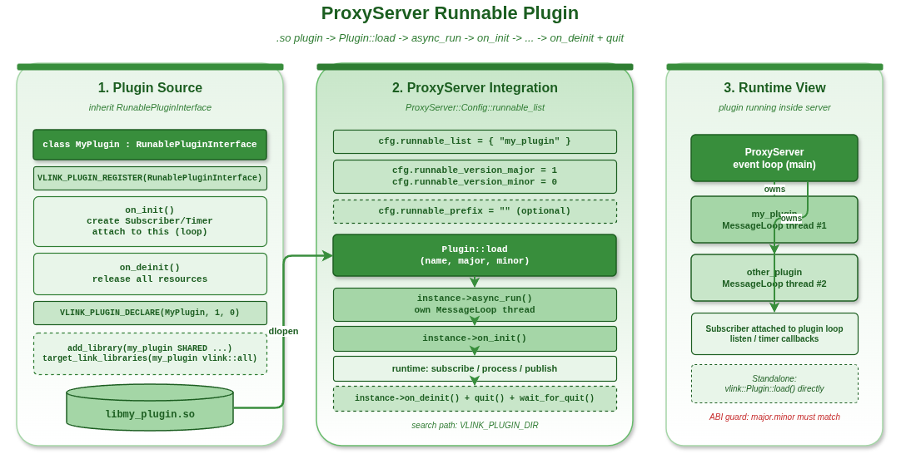

# Proxy Runnable 插件开发示例



## 1. 概述

本示例展示如何为 ProxyServer 开发 `RunablePluginInterface` 插件。这类插件拥有独立的事件循环，可以订阅主题、创建定时器，并由 ProxyServer 自动管理生命周期。

## 2. 开发流程

### 2.1 实现接口

```cpp
class AnalysisPlugin : public vlink::RunablePluginInterface {
public:
  void on_init() override {
    // 创建订阅者和定时器
    sub_ = std::make_unique<Subscriber<Bytes>>("dds://topic");
    sub_->attach(this);  // 绑定到插件自身的 MessageLoop
    sub_->listen([this](const Bytes& d) { process(d); });
  }

  void on_deinit() override {
    sub_.reset();
  }
};

VLINK_PLUGIN_DECLARE(AnalysisPlugin, 1, 0)
```

### 2.2 编译为共享库

```cmake
add_library(analysis_plugin SHARED analysis_plugin.cpp)
target_link_libraries(analysis_plugin vlink::all)
```

### 2.3 配置 ProxyServer 加载

```cpp
ProxyServer::Config cfg;
cfg.runnable_list = {"analysis_plugin"};   // 只填插件名，不带前缀和扩展名
cfg.runnable_version_major = 1;            // 必填，与插件 VLINK_PLUGIN_DECLARE 中的 major 匹配
cfg.runnable_version_minor = 0;            // 必填，与插件 VLINK_PLUGIN_DECLARE 中的 minor 匹配
cfg.runnable_prefix = "";                  // 可选，库名前缀（默认空）
```

## 3. ProxyServer 自动管理生命周期

1. 构造时加载插件
2. `async_run()` 时启动插件事件循环
3. 调用 `on_init()` 初始化
4. 运行期间插件处理事件
5. 停止时调用 `on_deinit()` + `quit()` + `wait_for_quit()`

## 4. 编译与运行

```bash
cd build
cmake .. && make example_proxy_runnable_plugin
./output/bin/example_proxy_runnable_plugin
```

## 5. 最佳实践

1. 使用插件的 MessageLoop（`this`）绑定所有回调
2. 在 `on_init()` 创建资源，在 `on_deinit()` 释放
3. 不要在 `on_init()` / `on_deinit()` 中阻塞
4. 使用 `VLINK_PLUGIN_DIR` 设置插件搜索路径
5. 匹配版本号确保 ABI 兼容
