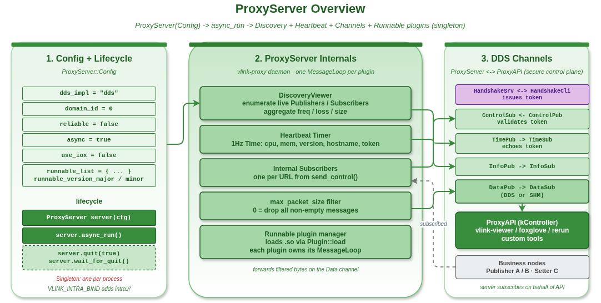

# proxy_server_basic — ProxyServer 守护进程：discovery + 握手 + 心跳 + 转发

`vlink::ProxyServer` 是 vlink Proxy 系统的服务端：跑在被观察的目标机器上，做 topic discovery、握手、心跳、消息转发、插件生命周期管理。本示例演示如何配置并启动 ProxyServer。

读完本示例你能掌握：

- ProxyServer Config 各字段含义。
- 服务端的核心能力（discovery / handshake / heartbeat / forwarding）。
- wire 协议中 Handshake / Control / Time / InfoList / Data 五种通道的语义。
- 单进程单实例约束。

## 背景与适用场景

适用：

- 把 vlink topics 暴露给外部观察工具（Foxglove、自家 Web GUI）。
- 远程 bag 录制器。
- 跨机器的调试辅助。

不适合：

- 同进程内的消息查看（直接订阅）。
- 多 Server 拓扑（vlink Proxy 假定单实例单进程）。

## 能力

- **Topic discovery**：通过 `DiscoveryViewer` 探测当前进程的所有 vlink topics。
- **Token 握手**：`HandshakeSrv` 接收 ProxyAPI 的握手请求并发放 128-bit token。
- **1Hz 心跳**：周期广播 server 端 CPU / mem stats 和身份。
- **per-topic Info**：每 topic 频率 / 速率 / 丢包 / 延迟。
- **Data 转发**：observe / record / play 模式下转发消息。
- **插件生命周期**：从 `Config::runnable_list` 加载 RunablePlugin，管理 init/run/deinit。

## Config

```cpp
vlink::ProxyServer::Config cfg;
cfg.dds_impl     = "dds";       // DDS 实现
cfg.domain_id    = 0;
cfg.security_key = "";          // 非空时与 ProxyAPI 必须一致
cfg.reliable     = false;
cfg.async        = true;
cfg.use_iox      = false;       // 是否走 Iceoryx SHM
```

字段语义：

- `async = true`：server 在后台线程跑；主程序可以做别的事。
- `use_iox = true`：data 转发走 Iceoryx 共享内存（零拷贝），但要求 RouDi。
- `reliable = true`：DDS reliable QoS；可靠但开销大。

## 核心 API

| API | 签名 | 说明 |
|-----|------|------|
| `ProxyServer(const Config&)` | 构造 | 配置；不会立即启动 |
| `ProxyServer::start` | `bool start()` | 启动 |
| `ProxyServer::stop` | `void stop()` | 停止 |
| `ProxyServer::is_running` | `bool` | 状态 |
| 单实例约束 | – | 一个进程内只能构造一个；第二个会 fatal log |

## Wire 协议

```
ProxyAPI (Controller)              ProxyServer
   |  Handshake RPC      ───────►   token 发放
   |  Control + token    ───────►
   |  ◄── Time + token (1Hz heartbeat)
   |  ◄── Info (per-topic stats)
   |  ◄── Data (DDS 或 SHM)
```

## 代码导读

### 1. 基础启动

```cpp
vlink::ProxyServer::Config cfg;
cfg.dds_impl = "dds";
cfg.domain_id = 0;
cfg.async = true;

vlink::ProxyServer server(cfg);
if (!server.start()) {
  VLOG_E("failed to start ProxyServer");
  return 1;
}

VLOG_I("server running, press Ctrl-C to quit");
// ... 主程序做事 ...

server.stop();
```

### 2. 配合 RunablePlugin

```cpp
vlink::ProxyServer::Config cfg;
cfg.runnable_list = {"monitor_plugin"};
cfg.runnable_version_major = 1;
cfg.runnable_version_minor = 0;
vlink::ProxyServer server(cfg);
server.start();
// server 自动 load + init + run + 在 stop 时 deinit
```

详见 `../proxy_runnable_plugin/`。

### 3. 与 intra:// topics 互通

```bash
VLINK_INTRA_BIND=1 ./build/output/bin/example_proxy_server_basic
```

`VLINK_INTRA_BIND` 让 server 能观察 `intra://` 进程内 topics。

## 运行

```bash
./build/output/bin/example_proxy_server_basic
```

预期输出（节选）：

```
ProxyServer started (dds_impl=dds domain=0)
heartbeat sent (cpu=1.2% mem=...)
discovered topic: dds://test/topic
```

按 Ctrl-C 优雅退出。

## 常见陷阱

1. **多个 server 在同进程**：第二次构造 fatal log + 不 init；架构上每进程一个。
2. **security_key 单边设**：握手失败；要么都设、要么都不设。
3. **没有 RouDi 时 use_iox=true**：start() 失败；ROUDI 必须先跑。
4. **跨进程多 server**：网络中检测到多 server 时 ProxyAPI 会报 kMultiProxyError；按角色 / domain 划分清楚。
5. **intra:// 默认不可见**：必须 `VLINK_INTRA_BIND=1`。

## 设计要点

- Server 内部用 `HandshakeSrv` / `ControlSub` / `TimePub` / `InfoPub` 四条 DDS 安全控制面信道（其中 Handshake 走 RPC，其余走 pub/sub），加上 `DataPub` / `DataSub` 一对数据面信道。
- `HandshakeSrv` 是普通的 vlink Server<HandshakeReqPacket, HandshakeRespPacket>；token 加密后下发。
- 单进程单实例靠静态 atomic 哨兵实现。

## 配图



图中展示 ProxyServer 的内部组件：DiscoveryViewer / HandshakeSrv / Heartbeat / 插件管理器。

## 参考

- `../proxy_api_basic/` — 客户端
- `../proxy_runnable_plugin/` — Runnable 插件集成
- `vlink/include/vlink/external/proxy_server.h` — ProxyServer 接口
- 顶层 `doc/16-proxy.md` — Proxy 章节
