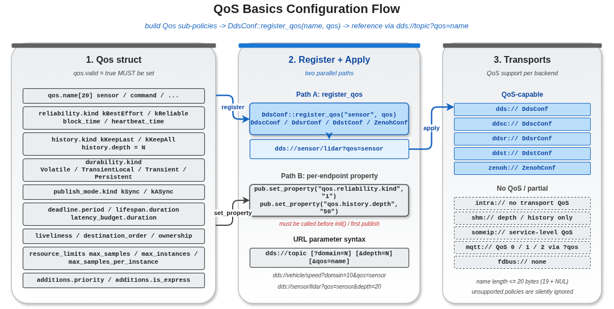

# qos_basics — 自定义 `vlink::Qos`、注册命名 Profile、通过 URL 引用

本示例演示 vlink QoS（Quality of Service）系统的完整工作流：构造一个 `vlink::Qos` 策略对象 → 通过对应后端的 `register_qos(name, qos)` 注册为命名 profile → 在 URL 中用 `?qos=name` 引用 → vlink 节点初始化时按 profile 应用 QoS。

QoS 是 DDS 家族（FastDDS、CycloneDDS、RTI Connext、TravoDDS、Zenoh）核心的可靠性 / 持久化 / 队列控制机制。`shm://`、`someip://`、`intra://`、`mqtt://`、`fdbus://` 等非 DDS 后端**忽略 QoS profile**（它们各自有内置的语义）。

读完本示例你能掌握：

- `vlink::Qos` 结构的主要子策略（Reliability / History / Durability / PublishMode / Deadline / Lifespan / ResourceLimits）。
- 怎样为 sensor / command 两种典型场景配出合理的 QoS。
- `DdsConf::register_qos` / `DdscConf::register_qos` 等的注册接口。
- URL 中 `?qos=...` 的引用语法。

## 背景与适用场景

DDS 的 QoS 模型最早是为军用 / 工业级实时系统设计的，覆盖了"消息可靠性"、"历史保留"、"延迟订阅者补送"、"实时截止时间"等很多正交的策略。vlink 把这套模型抽象为 `vlink::Qos` 结构，并在各 DDS 后端把它映射成对应的原生 QoS。

典型场景：

- **传感器流式数据**：BestEffort + KeepLast(浅深度) + Async + Volatile，吞吐优先、延迟次之、不补送。
- **控制命令 / 关键事件**：Reliable + KeepAll + Sync + TransientLocal，绝对不能丢、晚加入也能补到、按写入序送达。
- **状态字段**：Reliable + KeepLast(1) + TransientLocal + Sync，只关心最新值、补送给晚加入者。
- **大数据传输**：用 ResourceLimits 控制内存消耗，配合更大的 history depth。

非 DDS 后端的取舍：

- `intra://`：进程内传输，无 QoS 概念；Reliable 由进程地址空间保证。
- `shm://`：共享内存，QoS 由 Iceoryx 配置文件控制（独立配置）。
- `someip://`：AUTOSAR 协议，可靠性靠 TCP/UDP 选项控制。
- `mqtt://`：用 MQTT 协议自己的 QoS 0/1/2。
- `fdbus://`：内置 QoS 弱（消息可丢、顺序可乱）。

## 核心 API

| API | 签名 | 说明 |
|-----|------|------|
| `vlink::Qos` | 默认构造 | 所有字段默认值 + `valid=false` |
| `vlink::Qos::name` | `char[20]` | profile 名字；含 NUL 不超 20 字节 |
| `vlink::Qos::valid` | `bool` | true 才会被注册接受；默认 false |
| `vlink::Qos::reliability` | 子结构 | `{ kind, block_time, heartbeat_time }` |
| `vlink::Qos::history` | 子结构 | `{ kind, depth }` |
| `vlink::Qos::durability` | 子结构 | `{ kind: Volatile/TransientLocal/Transient/Persistent }` |
| `vlink::Qos::publish_mode` | 子结构 | `{ kind: Sync/ASync }` |
| `vlink::Qos::deadline` | 子结构 | `{ period }` 单位 ms |
| `vlink::Qos::lifespan` | 子结构 | `{ duration }` 单位 ms |
| `vlink::DdsConf::register_qos` | `static void register_qos(std::string name, Qos qos)` | 注册到 FastDDS 后端 |
| `vlink::DdscConf::register_qos` | 同上 | CycloneDDS |
| `vlink::DdsrConf::register_qos` | 同上 | RTI Connext |
| `vlink::DdstConf::register_qos` | 同上 | TravoDDS |
| `vlink::ZenohConf::register_qos` | 同上 | Zenoh |

URL 引用语法：`<transport>://<topic>?qos=<name>&...`。

## 代码导读

### 1. 默认 QoS（不会被使用）

```cpp
vlink::Qos defaults;
print_qos(defaults);
```

默认构造的 `Qos` 把 `valid=false`，`register_qos` 会忽略它。这是一个安全机制：阻止用户误把没填字段的 Qos 注册上去。

### 2. sensor profile（高吞吐、可丢、不补送）

```cpp
vlink::Qos sensor_qos;
std::strncpy(sensor_qos.name, "sensor", sizeof(sensor_qos.name) - 1);
sensor_qos.valid = true;
sensor_qos.reliability.kind = vlink::Qos::Reliability::kBestEffort;
sensor_qos.history.kind = vlink::Qos::History::kKeepLast;
sensor_qos.history.depth = 5;
sensor_qos.durability.kind = vlink::Qos::Durability::kVolatile;
sensor_qos.publish_mode.kind = vlink::Qos::PublishMode::kASync;
sensor_qos.deadline.period = 100;
sensor_qos.lifespan.duration = 500;

vlink::DdsConf::register_qos("sensor", sensor_qos);

vlink::Publisher<std::string> pub("dds://sensor/lidar_data?qos=sensor");
vlink::Subscriber<std::string> sub("dds://sensor/lidar_data?qos=sensor");
```

逐项含义：

- `BestEffort` —— 不可靠交付，无重传；丢了就丢了。
- `KeepLast(5)` —— 历史队列保留最近 5 条；超过就覆盖最老。
- `Volatile` —— 晚加入的订阅者不会收到加入前的消息。
- `Async` —— `publish()` 不等真正下发，立即返回。
- `deadline.period=100` —— 期望每 100ms 至少一次写入；超时会触发 deadline 回调（如启用）。
- `lifespan.duration=500` —— 消息生命周期 500ms；超过被丢弃，不再交付。

### 3. command profile（可靠、不丢、补送）

```cpp
vlink::Qos cmd_qos;
std::strncpy(cmd_qos.name, "command", sizeof(cmd_qos.name) - 1);
cmd_qos.valid = true;
cmd_qos.reliability.kind = vlink::Qos::Reliability::kReliable;
cmd_qos.reliability.block_time = 500;
cmd_qos.reliability.heartbeat_time = 1000;
cmd_qos.history.kind = vlink::Qos::History::kKeepAll;
cmd_qos.durability.kind = vlink::Qos::Durability::kTransientLocal;
cmd_qos.publish_mode.kind = vlink::Qos::PublishMode::kSync;

vlink::DdsConf::register_qos("command", cmd_qos);

vlink::Server<std::string, std::string> server("dds://control/brake?qos=command");
server.listen([](const std::string& req, std::string& resp) { resp = "ACK:" + req; });

vlink::Client<std::string, std::string> client("dds://control/brake?qos=command");

if (client.wait_for_connected(2s)) {
  auto resp = client.invoke("emergency_stop");
  if (resp.has_value()) {
    VLOG_I("Command response:", resp.value());
  }
}
```

逐项含义：

- `Reliable` —— 消息必送达，丢失时重传。
- `block_time=500` —— Publisher 发送时若资源耗尽（queue 满）最多阻塞 500ms 等空间。
- `heartbeat_time=1000` —— 心跳间隔，影响重传探测时延。
- `KeepAll` —— 历史全保留，直到资源耗尽。
- `TransientLocal` —— Publisher 缓存最近 history 条消息；晚加入的 Subscriber 通过 discovery 拉取补送。
- `Sync` —— `publish()` 阻塞到确认下发（取决于后端实现细节）。

### 4. 后端注册接口对照

```cpp
VLOG_I("Registration: dds=DdsConf::register_qos, ddsc=DdscConf::register_qos,",
       " ddsr=DdsrConf::register_qos, ddst=DdstConf::register_qos, zenoh=ZenohConf::register_qos");
VLOG_I("intra/shm/someip/mqtt/fdbus do not use Qos profiles");
```

各 DDS-family 后端有独立 `register_qos` 接口；注册的 profile 只在对应后端的 URL 上生效（`dds://` 用 DdsConf，`ddsc://` 用 DdscConf，以此类推）。

## 运行

```bash
./build/output/bin/example_qos_basics
```

预期输出（节选）：

```
QoS= valid=0 reliability=Reliable history=KeepLast depth=1 durability=Volatile publish_mode=Sync deadline=0ms lifespan=0ms
QoS=sensor valid=1 reliability=BestEffort history=KeepLast depth=5 durability=Volatile publish_mode=ASync deadline=100ms lifespan=500ms
Received with sensor QoS:lidar_frame_001
QoS=command valid=1 reliability=Reliable history=KeepAll depth=1 durability=TransientLocal publish_mode=Sync deadline=0ms lifespan=0ms
Command response:ACK:emergency_stop
Registration: dds=DdsConf::register_qos, ddsc=DdscConf::register_qos, ...
intra/shm/someip/mqtt/fdbus do not use Qos profiles
```

`dds://` 部分需要 vlink 启用 FastDDS 组件（`vlink::dds`）；未启用时会打印 `DDS module not available; skipping registration.` 并跳过 DDS 那段。

## 常见陷阱

1. **`Qos::valid = false`**：忘记设 valid 会让 `register_qos` 静默忽略；profile 注册不上但日志不会提示。
2. **`name` 超过 20 字节**：被截断，URL `?qos=...` 引用不到注册的 profile。
3. **同名 profile 多次注册**：后注册的覆盖前面的；不会报错，但容易引入隐蔽 bug。
4. **`?qos=foo` 不存在**：vlink 行为是后端默认 QoS（取决于具体实现），不会报错。可以打开 vlink trace 日志确认实际生效的 QoS。
5. **跨后端混用 profile**：`DdsConf::register_qos("foo", ...)` 注册的 profile 只在 `dds://` URL 上有效；`ddsc://` 看不到。要多后端共用必须每个都 register 一次。

## 设计要点

- `vlink::Qos` 是一个普通 C 结构，可以被 memcpy / 序列化；vlink 不会持有它的内存，只在 register 时复制。
- 子策略字段都有默认值；只填要改的字段即可，无需逐项设。
- 默认 `Reliable + KeepLast(1) + Volatile + Sync`，这是 DDS 业界的"安全默认"。
- 同 URL 上 Publisher 和 Subscriber 的 QoS 必须兼容（DDS 协议级要求）；不兼容时 discovery 不会撮合。

## 配图



图中展示 Qos 结构 → register_qos → URL 引用 → 节点初始化的完整流程。

## 参考

- `../qos_history_depth/` — 历史深度对吞吐/内存的影响
- `../qos_profiles/` — vlink 内置预设 profile（kEvent / kMethod / kField / kSensor 等）
- 顶层 `doc/08-qos.md` — QoS 全部子策略详细规范
- `vlink/include/vlink/extension/qos.h` — `Qos` 结构定义
- `vlink/include/vlink/modules/dds_conf.h` — `DdsConf::register_qos` 接口
