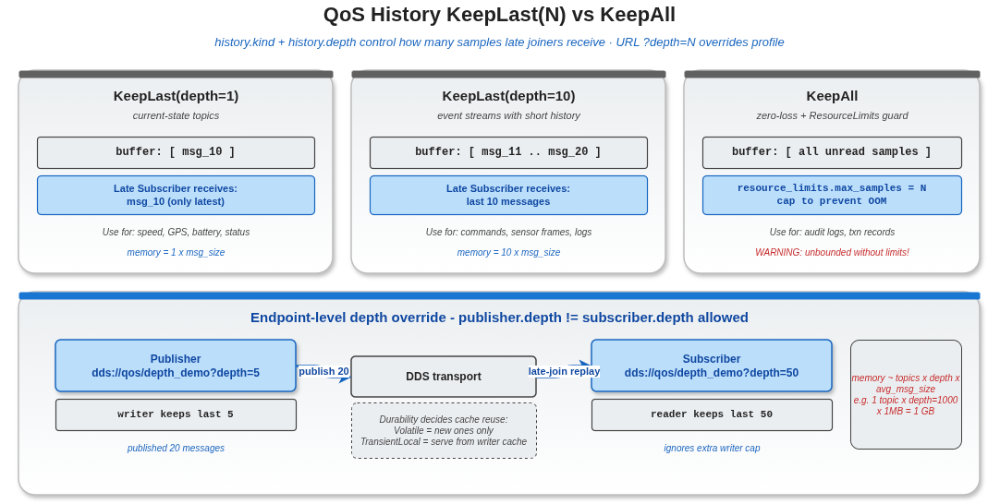

# QoS 历史深度示例



## 1. 概述

本示例演示 History 深度对消息保留的影响，包括 KeepLast(depth=1)、KeepLast(depth=10)、KeepAll 模式，以及 TransientLocal 持久性下的迟到订阅者行为。

## 2. History 模式

| 模式 | 行为 |
|------|------|
| KeepLast(depth=N) | 保留最近 N 条消息 |
| KeepAll | 保留所有消息（受 ResourceLimits 限制） |

## 3. 迟到订阅者

当 Durability 设为 TransientLocal 时，写入器缓存中的消息会发送给迟到加入的订阅者：

```
Publisher: depth=5, durability=TransientLocal
  -> 发布 10 条消息
  -> 缓存保留最后 5 条

Late Subscriber: depth=5, durability=TransientLocal
  -> 加入后收到缓存中的最后 5 条
```

## 4. 编译与运行

```bash
cd build
cmake .. && make example_qos_history_depth
./output/bin/example_qos_history_depth
```

## 5. 注意事项

- KeepAll 模式下必须配合 ResourceLimits 防止内存无限增长
- History 深度在 `intra://` 上效果有限，在 DDS 传输上最为明显
- TransientLocal 迟到者支持需要 DDS 传输
- depth=1 适合状态值（只关心最新值），depth>1 适合事件流
