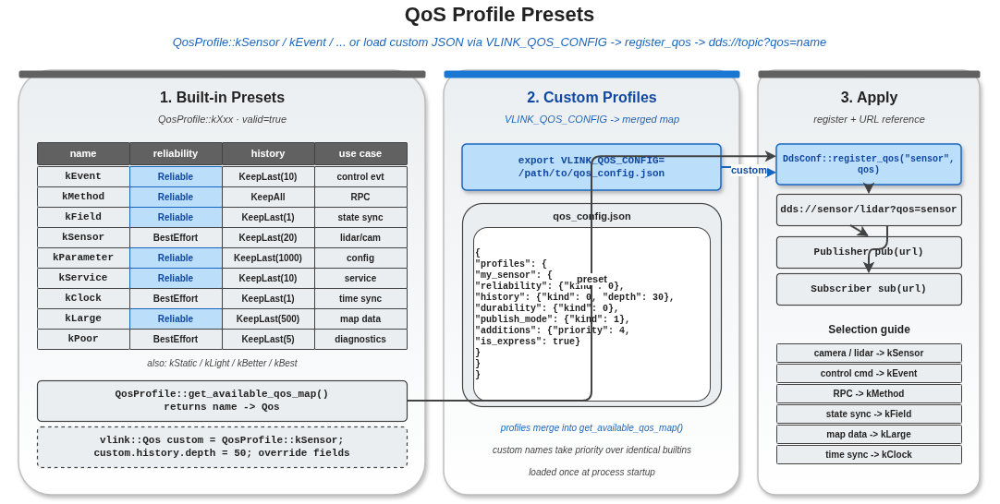

# qos_profiles — 使用 `QosProfile::*` 预设 + 名称查找 + JSON 扩展

vlink 在 `vlink/extension/qos_profile.h` 里预定义了 13 个常用 QoS profile，覆盖绝大多数业务场景。这些 profile 已经设好 `valid=true`，可以直接传给后端，省去逐字段填表。

本示例覆盖：

- 列出 13 个内置 profile 的字段值。
- 通过 `QosProfile::get_available_qos_map()` 按名字运行时查找。
- 把内置 profile 应用到 Publisher/Subscriber。
- 复制内置 profile 并按需修改字段（"基线 + 微调"模式）。
- 通过环境变量 `VLINK_QOS_CONFIG` 指向 JSON 文件加载额外 profile。

读完本示例你能掌握：

- 13 个预设各自适合什么 topic 类别。
- 怎么按业务挑预设、何时需要自定义。
- 怎么用 JSON 扩展 profile（不改代码动态加载）。

## 背景与适用场景

业务代码里 99% 的 QoS 需求可以靠预设解决：

| 场景 | 预设 | 关键特征 |
|------|------|---------|
| 相机 / 雷达 / 激光 | `kSensor` | BestEffort、KeepLast(浅) |
| 控制事件、关键指令 | `kEvent` | Reliable、KeepLast、Sync |
| RPC 调用 | `kMethod` | Reliable、Sync |
| 状态同步 | `kField` | Reliable、TransientLocal、KeepLast(1) |
| 参数下发 | `kParameter` | Reliable、TransientLocal、深 history |
| 服务（持续在线） | `kService` | 长 lifespan |
| 时钟同步 | `kClock` | RealTime priority、低延迟 |
| 静态配置 | `kStatic` | Persistent durability |
| 轻量、可丢 | `kLight` | BestEffort、Async |
| 诊断、容差大 | `kPoor` | BestEffort |
| 高质量 | `kBetter` | Reliable + 较大 depth |
| 极致可靠 | `kBest` | Reliable + KeepAll + Sync |
| 大消息 | `kLarge` | Reliable、低 depth、大 ResourceLimits |

什么时候需要自定义：

- 字段值与预设差一点（如 `kSensor` + 自定义 deadline）。
- 业务对内存/CPU 极敏感，要逐字段调。
- 需要按部署环境（开发/生产）切换 —— 通常用 JSON 配置文件比改代码方便。

## 核心 API

| API | 类型 | 说明 |
|-----|------|------|
| `QosProfile::kEvent` 等 | `const vlink::Qos&` | 内置预设 |
| `QosProfile::get_available_qos_map` | `static std::unordered_map<std::string, Qos> get_available_qos_map()` | 运行时按名字查 |
| `VLINK_QOS_CONFIG` env | 字符串 | 指向 JSON 文件路径，启动时合并到 profile map |

## 代码导读

### 1. 打印所有内置预设

```cpp
log_profile("kEvent    ", vlink::QosProfile::kEvent);
log_profile("kMethod   ", vlink::QosProfile::kMethod);
log_profile("kField    ", vlink::QosProfile::kField);
log_profile("kSensor   ", vlink::QosProfile::kSensor);
log_profile("kParameter", vlink::QosProfile::kParameter);
log_profile("kService  ", vlink::QosProfile::kService);
log_profile("kClock    ", vlink::QosProfile::kClock);
log_profile("kStatic   ", vlink::QosProfile::kStatic);
log_profile("kLight    ", vlink::QosProfile::kLight);
log_profile("kPoor     ", vlink::QosProfile::kPoor);
log_profile("kBetter   ", vlink::QosProfile::kBetter);
log_profile("kBest     ", vlink::QosProfile::kBest);
log_profile("kLarge    ", vlink::QosProfile::kLarge);
```

`log_profile` 把 Reliability / History / Durability / PublishMode / Priority / Express 几个最关键字段打到一行；可以直观对照不同预设的差异。

### 2. 按名字运行时查找

```cpp
const auto& qos_map = vlink::QosProfile::get_available_qos_map();
VLOG_I("Profiles registered: ", qos_map.size());

auto it = qos_map.find("sensor");

if (it != qos_map.end()) {
  log_profile("lookup(sensor)", it->second);
}
```

`get_available_qos_map()` 返回 `name → Qos` 的 unordered_map；name 是去掉 `k` 前缀的小写串，例如 `kSensor` 对应 `"sensor"`。

### 3. 应用预设

```cpp
std::atomic<int> received{0};
vlink::Subscriber<std::string> sub("dds://qos_profiles/sensor");
sub.listen([&received](const std::string& msg) {
  (void)msg;
  received++;
});

vlink::Publisher<std::string> pub("dds://qos_profiles/sensor");
pub.wait_for_subscribers();

for (int i = 0; i < 50; ++i) {
  pub.publish("sensor_data_" + std::to_string(i));
}
```

注意这里**没有**显式在 URL 上加 `?qos=sensor` —— vlink 在 DDS 后端会按 URL 自动 attach 预设吗？答案是 **不会**：内置预设需要手工通过 URL `?qos=sensor` 引用，或者用 `DdsConf::register_qos` 先注册再引用。本示例为了演示效果直接 publish，实际使用应在 URL 加 `?qos=sensor`。

### 4. 复制并微调

```cpp
vlink::Qos custom_sensor = vlink::QosProfile::kSensor;
std::strncpy(custom_sensor.name, "custom_sensor", sizeof(custom_sensor.name) - 1);
custom_sensor.history.depth = 50;
custom_sensor.reliability.kind = vlink::Qos::Reliability::kReliable;
custom_sensor.deadline.period = 100;
log_profile("custom_sensor", custom_sensor);
```

"基线 + 微调"模式：拷贝预设、改名字、改若干字段、注册到后端。这是生产代码最常见的 QoS 构造方式。

### 5. JSON profile

```cpp
const char* qos_config = std::getenv("VLINK_QOS_CONFIG");

if (qos_config != nullptr) {
  VLOG_I("VLINK_QOS_CONFIG=", qos_config, " (custom profiles merged into the preset map)");
} else {
  VLOG_I("VLINK_QOS_CONFIG unset. Point it at a JSON file to add named profiles at startup.");
}
```

`VLINK_QOS_CONFIG` 是 vlink 在启动时读的环境变量；指向一个 JSON 文件即可注入额外 profile，无需改代码。详见 `doc/21-environment-vars.md`。

## 运行

```bash
./build/output/bin/example_qos_profiles
```

预期输出（节选）：

```
kEvent    : Reliable, KeepLast(depth=10), Volatile, Sync, Priority=Normal
kMethod   : Reliable, KeepLast(depth=1), Volatile, Sync, Priority=High
kField    : Reliable, KeepLast(depth=1), TransientLocal, Sync, Priority=Normal
kSensor   : BestEffort, KeepLast(depth=5), Volatile, ASync, Priority=Normal
kParameter: Reliable, KeepLast(depth=20), TransientLocal, Sync, Priority=Normal
kClock    : BestEffort, KeepLast(depth=1), Volatile, ASync, Priority=RealTime, Express
...
Profiles registered: 13
lookup(sensor): BestEffort, KeepLast(depth=5), Volatile, ASync, Priority=Normal
kSensor profile: sent 50, received <= 50
custom_sensor: Reliable, KeepLast(depth=50), Volatile, ASync, Priority=Normal
VLINK_QOS_CONFIG unset. Point it at a JSON file to add named profiles at startup.
Selection: camera/lidar=kSensor, control=kEvent, RPC=kMethod, state=kField, diag=kPoor, clock=kClock, map=kLarge, params=kParameter
```

## 常见陷阱

1. **直接复制预设不改 name**：注册时与原预设同名，会覆盖原预设；后续用 `kSensor` 拿到的是你改后的。要么改 name，要么用本地变量不 register。
2. **`get_available_qos_map()` 返回的是只读拷贝**：修改其中字段不影响 vlink 内部的真实预设。
3. **预设字段不一定满足你的场景**：例如 `kSensor` 是 BestEffort，但你想 Reliable + 浅 depth + Async，必须自定义。
4. **JSON profile 与 C++ 预设冲突**：JSON 中同名 profile 会覆盖 C++ 预设；按"启动时合并"语义。
5. **URL `?qos=sensor`**：vlink 在 URL 上找到预设名后，按对应后端 register 一遍并应用。

## 设计要点

- 预设是 `const vlink::Qos&`，C++ 编译期常量；不会运行时变。
- `get_available_qos_map()` 是按需构建并返回的 map；不要在热路径反复调用。
- JSON profile 加载在 vlink 初始化时一次性完成；运行时不会重新读文件。
- 命名 profile 是后端特定的：FastDDS、CycloneDDS、Zenoh 等各自维护自己的 profile 表；同名 profile 在不同后端是独立实例。

## 配图



图中以矩阵方式展示 13 个预设在 Reliability / History / Durability / PublishMode 四个维度的取值。

## 参考

- `../qos_basics/` — 自定义 Qos 与注册流程
- `../qos_history_depth/` — history & depth 深入
- 顶层 `doc/08-qos.md` — QoS 完整规范
- 顶层 `doc/21-environment-vars.md` — `VLINK_QOS_CONFIG` 环境变量
- `vlink/include/vlink/extension/qos_profile.h` — QosProfile 完整声明
