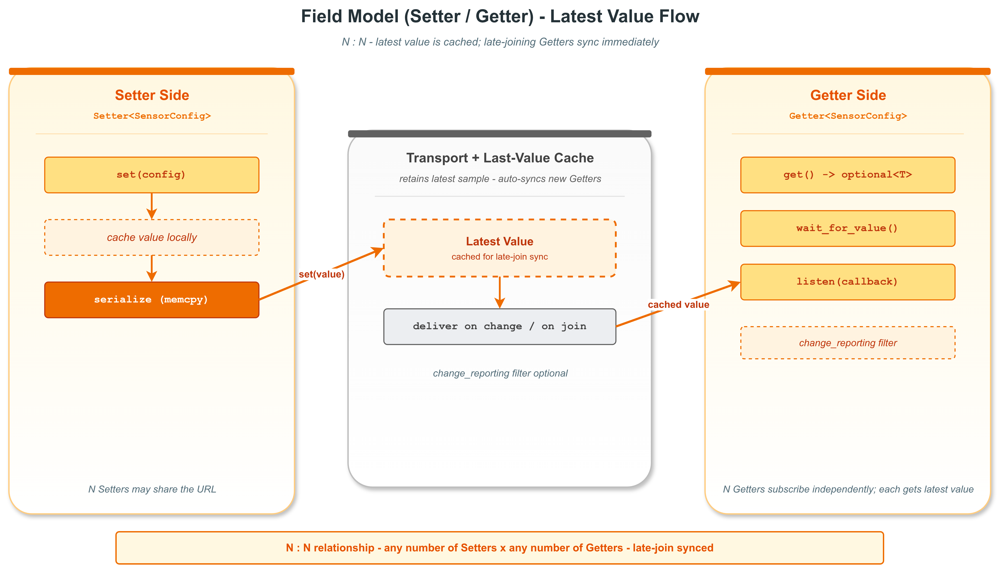

# Hello Field -- VLink 字段模型入门（配置同步）

## 概述

本示例演示 VLink 的 **字段模型 (Field Model)**，通过一个传感器配置同步场景，展示 Setter/Getter 的跨程序用法。与事件模型（PubSub）不同，字段模型会**保留最新值**，迟到的 Getter 也能立即获取当前状态。

本示例拆分为**两个独立程序**：
- **config_setter** -- 写入端，模拟配置管理系统写入传感器参数
- **config_getter** -- 读取端，演示三种读取模式（阻塞等待、轮询、回调通知）

### 架构图



```
┌──────────────────────┐                    ┌──��───────────────────────┐
│    config_setter     │                    │     config_getter        │
│   (config_setter.cc) │                    │    (config_getter.cc)    │
│                      │                    │                          │
│  Setter<SensorConfig>│                    │  Getter<SensorConfig>    │
│       │              │                    │    ├─ wait_for_value()   │
│   set(cfg) ─────────>│ intra://sensor/... │<───├─ get() -> optional  │
│                      │   (Transport)      │    └─ listen(callback)   │
└──────────────────────┘                    └──────────────────────────┘
```

## 文件结构

| 文件 | 说明 |
|------|------|
| `config_types.h` | 共享 POD 配置结构体 `SensorConfig` 和 URL 常量 |
| `config_setter.cc` | 主程序：Setter 端，写入配置值 |
| `config_getter.cc` | 主程序：Getter 端，读取配置值 |
| `CMakeLists.txt` | 构建两个可执行文件 |

## 字段模型 vs 事件模型

| 特性 | 字段模型 (Setter/Getter) | 事件模型 (Publisher/Subscriber) |
|------|--------------------------|--------------------------------|
| 值保留 | 保留最新值，迟到的 Getter 可读取 | 不保留，Subscriber 只收实时消息 |
| 读取方式 | `get()` 轮询 / `wait_for_value()` 阻塞 / `listen()` 回调 | 仅 `listen()` 回调 |
| 典型场景 | 配置参数、车速、档位等**状态量** | 事件通知、日志流等**事件流** |
| 迟到连接 | Setter 自动同步最新值给新 Getter | 无同步机制 |

## POD 类型定义

```cpp
// config_types.h
struct SensorConfig {
  int sample_rate_hz;       // Sampling rate in Hz
  int filter_window_size;   // Moving-average filter window
  float threshold_low;      // Low alarm threshold (Celsius)
  float threshold_high;     // High alarm threshold (Celsius)
  int64_t updated_at_ms;    // Timestamp of last update
};
```

**重要**：POD 结构体不能使用默认成员初始化器（如 `int x{0};`），必须使用 `int x;` 的形式。VLink 使用 `kStandardType` 序列化器，通过 `memcpy` 直接传输 POD 数据。

## 关键代码逐步解析

### 1. config_setter.cc -- 写入端

#### 创建 Setter 并设置初始值

```cpp
Setter<example::SensorConfig> setter(example::kConfigUrl);

example::SensorConfig initial_cfg{};
initial_cfg.sample_rate_hz = 100;
initial_cfg.filter_window_size = 5;
initial_cfg.threshold_low = 15.0f;
initial_cfg.threshold_high = 35.0f;
initial_cfg.updated_at_ms = now_ms();

setter.set(initial_cfg);
```

`set()` 做了两件事：
1. 将值缓存到 Setter 内部的 `std::optional<ValueT>` 中
2. 序列化后通过传输层发送给所有已连接的 Getter

当新的 Getter 连接时，Setter 会通过内部 `sync()` 回调**自动重发**缓存的值，这就是迟到连接（Late Join）的实现原理。

#### 模拟周期性配置更新

```cpp
for (const auto& u : updates) {
    std::this_thread::sleep_for(std::chrono::milliseconds(500));
    example::SensorConfig cfg{};
    cfg.sample_rate_hz = u.sample_rate_hz;
    // ...
    setter.set(cfg);
}
```

每次调用 `set()` 都会触发已��接的 Getter 的 `listen()` 回调。

### 2. config_getter.cc -- 读取端

#### 三种读取模式

**模式一：阻塞等待 (wait_for_value)**
```cpp
if (getter.wait_for_value(std::chrono::milliseconds(3000))) {
    // 有值了
}
```
阻塞调用线程，直到收到第一个值或超时。内部使用 `vlink::ConditionVariable` 实现。这是最适合初始化阶段的��取方式。

**模式二：轮询 (get)**
```cpp
auto current = getter.get();  // 返�� std::optional<SensorConfig>
if (current.has_value()) {
    // 使用 current.value()
}
```
非阻塞调用，返回最近一次缓存的值。如果还没收到任何值，返回 `std::nullopt`。

**方式三：回调通知 (listen)**
```cpp
getter.listen([](const example::SensorConfig& cfg) {
    // 每次 Setter 调用 set() 都会触发
});
```
注册回调函数，每次值变化时自动触发。如果 Getter 通过 `attach()` 绑定了 MessageLoop，回调在 loop 线程上执行。

### 3. 迟到连接演示

本示例中，Setter **先于** Getter 设置了初始值。当 Getter 创建并连接后，Setter 自动同步最新值，所以 `wait_for_value()` 几乎��刻返回成功。这是字段模型与事件模型的核心区别。

## intra:// 传输限制

使用 `intra://` 传输时，Setter 和 Getter 必须在**同一进程**内。本示例的两个 `main()` 函数分别独立编译，如果使用 `intra://` 传输，它们无法跨进程通信。

实际部署中应切换到跨进程传输：

```cpp
// 共享内存（同一台机器）
static const char* const kConfigUrl = "shm://sensor/config";

// DDS（跨网络）
static const char* const kConfigUrl = "dds://sensor/config";
```

在同一进程内测试时，可以在一个 main() 中同时创建 Setter 和 Getter，或者直接使用 `intra://`。

## 编译与运行

```bash
# 编译两个目标
cmake --build . --target example_config_setter
cmake --build . --target example_config_getter

# 运行 Setter（先启动）
./output/bin/example_config_setter

# 在另一个终端运行 Getter（需要 shm:// 或 dds:// 传输）
./output/bin/example_config_getter
```

## 预期输出

### config_setter 输出
```
[I] === VLink Config Setter ===
[I] [Setter] Created on intra://sensor/config
[I] [Setter] Initial config: rate=100Hz filter=5 low=15 high=35
[I] [Setter] Updated config: rate=200Hz filter=10 low=10 high=40
[I] [Setter] Updated config: rate=100Hz filter=3 low=18 high=30
[I] [Setter] Updated config: rate=500Hz filter=8 low=12 high=38
[I] [Setter] Updated config: rate=50Hz filter=15 low=20 high=28
[I] === Config Setter complete ===
```

### config_getter 输出
```
[I] === VLink Config Getter ===
[I] [Getter] Created on intra://sensor/config
[I] [Getter] Waiting for initial value...
[I] [Getter] Change #1:
[I]   rate=100Hz filter=5 low=15 high=35 ts=...
[I] [Getter] wait_for_value() succeeded
[I] [Getter] Current config: rate=100Hz filter=5 low=15 high=35 ts=...
[I] [Getter] Listening for configuration changes...
[I] [Getter] Change #2:
[I]   rate=200Hz filter=10 low=10 high=40 ts=...
...
[I] [Getter] Final config: rate=50Hz filter=15 low=20 high=28 ts=...
[I] [Getter] Total changes received: 5
[I] === Config Getter complete ===
```

## 典型应用场景

- **传感器配置同步**：管理程序写入配置，多个采集节点读取最新参数
- **车辆状态监控**：车速、档位、电池电量等持续变化的状态量
- **系统参数热更新**：运行时修改系统参数，所有消费者自动收到更新
- **设备注册表**：设备上线时写入自身信息，监控系统随时查询

## 扩展思考

- **变化过滤**：调用 `getter.set_change_reporting(true)` 后，只有值真正变化时才触发 listen 回调，避免处理重复值
- **多 Getter**：可以创建多个 Getter 读取同一字段，所有 Getter 都能获取最新值
- **跨进程**：将 URL 改为 `shm://` 或 `dds://`，即可实现真正的跨进程配置同步

## 相关文档

详细原理参见 [doc/05-field-model.md](../../../doc/05-field-model.md)。
