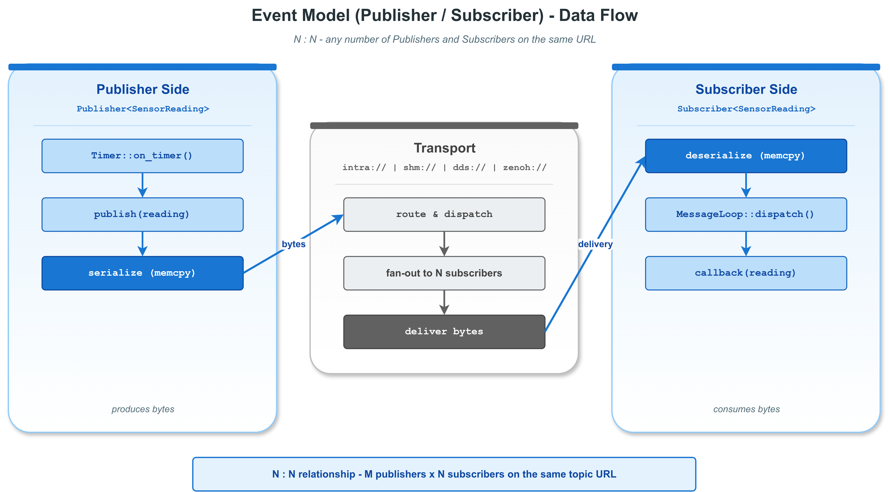

# Hello PubSub -- VLink 事件模型入门（传感器数据流）

## 1. 概述

本示例是 VLink 框架 **事件模型 (Event Model)** 的快速入门演示。通过一个温度传感器数据流场景，展示如何将 `Publisher`、`Subscriber`、`Timer` 和 `MessageLoop` 组合使用，构建一个完整的周期性数据发布/订阅系统。

与简单的字符串收发不同，本示例采用 **多文件结构**，将发布逻辑封装为可复用组件 `SensorPublisher`，体现工程实践中的模块化设计思路。

### 1.1 架构图



```
┌─────────────────────────┐           ┌──────────────────────────────┐
│    SensorPublisher      │           │         Subscriber           │
│  (sensor_publisher.h)   │           │     (hello_pubsub.cc)        │
│                         │           │                              │
│  Timer ──> on_timer()   │           │  listen(callback)            │
│            │            │           │    │                         │
│    Publisher<SensorReading>          │    └── 打印 sensor_id,       │
│            │            │           │        temperature, seq      │
│        publish(reading) │           │                              │
└────────────┼────────────┘           └──────────────┬───────────────┘
             │                                       │
             └───────── intra://sensor/temperature ──┘
                        (传输层自动匹配)
```

## 2. 文件结构

| 文件 | 说明 |
|------|------|
| `sensor_publisher.h` | 可复用组件：封装 `Publisher<SensorReading>` + `Timer`，周期性发布模拟温度数据 |
| `hello_pubsub.cc` | 主程序：创建 MessageLoop、Subscriber、SensorPublisher，组合并运行 |
| `CMakeLists.txt` | 构建配置，链接 `vlink::all` |

## 3. 核心概念

### 3.1 事件模型回顾

事件模型是 VLink 六大通信原语中最基本的模式：

- **Publisher** 是数据生产者，调用 `publish()` 发送消息
- **Subscriber** 是数据消费者，通过 `listen()` 注册回调
- 消息从 Publisher 到 Subscriber **单向流动**
- 支持 **N:N 拓扑**（任意多个 Publisher / Subscriber 同时订阅同一 URL）
- 不保留历史消息（迟到的 Subscriber 收不到之前的消息）

### 3.2 POD 类型与 kStandardType 序列化

```cpp
struct SensorReading {
  int sensor_id;
  float temperature;
  int64_t timestamp_ms;
  int sequence;
};
```

`SensorReading` 是一个 POD（Plain Old Data）类型，满足 `std::is_standard_layout_v` 和 `std::is_trivially_copyable_v`。VLink 在编译期自动检测到这一点，使用 `kStandardType` 序列化器，直接通过 `memcpy` 传输数据，**零序列化开销**。

**重要**：POD 结构体不能使用默认成员初始化器（如 `int x{0};`），否则在某些编译器上可能破坏 trivially copyable 属性。

### 3.3 Timer 与 MessageLoop 配合

Timer 不是独立的线程定时器，而是依附于 `MessageLoop` 的事件驱动定时器。每次定时器到期时，回调作为任务投递到 MessageLoop 队列中：

```cpp
Timer timer(&loop, 500, Timer::kInfinite, [this]() { on_timer(); });
timer.start();
```

- 第 1 个参数：关联的 MessageLoop
- 第 2 个参数：间隔（毫秒）
- 第 3 个参数：触发次数（`kInfinite` 表示无限）
- 第 4 个参数：回调函数

回调在 loop 线程上串行执行，与 Subscriber 回调共享同一线程，天然避免竞态条件。

## 4. 关键代码逐步解析

### 4.1 sensor_publisher.h -- 可复用组件封装

```cpp
class SensorPublisher {
 public:
  SensorPublisher(int sensor_id, const std::string& url,
                  vlink::MessageLoop* loop, int interval_ms)
      : sensor_id_(sensor_id),
        pub_(url),
        timer_(loop, interval_ms, vlink::Timer::kInfinite,
               [this]() { on_timer(); }) {}

  void start() { timer_.start(); }
  void stop()  { timer_.stop(); }
```

`SensorPublisher` 将 Publisher 和 Timer 封装在一起：
- 构造时创建 `Publisher<SensorReading>` 和 `Timer`
- `start()` / `stop()` 控制定时发布的开启和关闭
- Timer 回调 `on_timer()` 构造 `SensorReading` 并调用 `pub_.publish()`

这种封装方式使得发布逻辑可以在不同的应用中复用，只需提供 URL 和 MessageLoop 即可。

### 4.2 hello_pubsub.cc -- 主程序组合

#### 4.2.1 信号处理

```cpp
std::atomic<bool> running{true};
Utils::register_terminate_signal([&running](int sig) {
    VLOG_I("Signal ", sig, " received, shutting down...");
    running = false;
});
```

`Utils::register_terminate_signal()` 注册 SIGINT / SIGTERM 处理函数，收到信号时设置 `running = false`，触发主循环退出。适合生产环境中的守护进程场景。

#### 4.2.2 创建 MessageLoop

```cpp
MessageLoop loop;
loop.set_name("main_loop");
loop.async_run();
```

所有回调（Timer 定时发布 + Subscriber 接收回调）都在这个 loop 线程上串行执行。`async_run()` 在后台线程启动事件循环，主线程不阻塞。

#### 4.2.3 创建 Subscriber

```cpp
Subscriber<example::SensorReading> sub(kTopicUrl);
sub.attach(&loop);
sub.listen([&](const example::SensorReading& reading) {
    VLOG_I("[Subscriber] sensor_id=", reading.sensor_id,
           " seq=#", reading.sequence, " temp=", reading.temperature);
    // Auto-shutdown after kMaxMessages
});
```

- `sub.attach(&loop)` 将回调调度到 loop 线程上执行
- `listen()` 注册接收回调，每次收到消息时自动触发
- 回调只能注册一次，重复调用会触发 Fatal 错误

#### 4.2.4 创建 SensorPublisher 并启动

```cpp
example::SensorPublisher sensor(1, kTopicUrl, &loop, kPublishIntervalMs);
sensor.start();
```

一行创建、一行启动，所有复杂逻辑封装在 `sensor_publisher.h` 中。

#### 4.2.5 主循环等待

```cpp
while (running) {
    std::this_thread::sleep_for(100ms);
}
```

主线程以 100ms 粒度轮询 `running` 标志，直到收到信号或达到最大消息数。

#### 4.2.6 清理关闭

```cpp
sensor.stop();
loop.wait_for_idle(1000);
loop.quit();
loop.wait_for_quit();
```

关闭顺序：先停 Timer，再等 loop 处理完剩余任务，最后退出 loop 线程。

## 5. 消息流转过程

```
1. Timer 到期 -> MessageLoop 调度 on_timer()
   └─> 构造 SensorReading{sensor_id=1, temp=23.1, seq=1, ts=...}
   └─> pub_.publish(reading)
       └─> kStandardType: memcpy(SensorReading) -> Bytes
       └─> intra:// 传输层分发给所有匹配的 Subscriber

2. intra:// 传输层投递到 Subscriber 的 pipeline
   └─> 因为 attach 了 loop，所以 post_task 到 loop 线程
   └─> 等待当前正在执行的任务完成（串行执行）

3. loop 线程执行 Subscriber 回调
   └─> 反序列化 Bytes -> SensorReading (memcpy)
   └─> 调用 listen 注册的 lambda
   └─> 打印 sensor_id, temperature, sequence
```

## 6. intra:// 传输详解

`intra://` 是 VLink 的进程内传输，适合同一进程内不同模块之间的通信：

- **零基础设施**：不需要外部守护进程、网络配置或共享内存设置
- **高性能**：消息在进程内通过 pipeline 队列传递，延迟极低
- **适用场景**：模块解耦、单元测试、原型开发

## 7. 切换传输层

VLink 的核心优势之一是 **传输透明**：只需修改 URL 中的 transport 字段，即可切换底层传输协议：

```cpp
// 进程内传输（零配置，适合开发测试）
static const std::string kTopicUrl = "intra://sensor/temperature";

// 共享内存传输（跨进程，高性能）
static const std::string kTopicUrl = "shm://sensor/temperature";

// DDS 传输（跨网络，自动发现）
static const std::string kTopicUrl = "dds://sensor/temperature";

// Zenoh 传输（跨网络，轻量级）
static const std::string kTopicUrl = "zenoh://sensor/temperature";
```

业务代码完全不需要修改，Publisher、Subscriber、Timer、MessageLoop 的用法完全相同。这使得同一套代码可以从开发阶段（intra://）平滑过渡到部署阶段（dds:// 或 shm://）。

## 8. 编译与运行

```bash
# 在 VLink 构建目录中
cmake --build . --target example_hello_pubsub
./output/bin/example_hello_pubsub

# 或者独立编译
mkdir build && cd build
cmake /path/to/examples/quickstart/hello_pubsub -DCMAKE_PREFIX_PATH=/path/to/vlink/install
make
```

## 9. 预期输出

```
[I] === VLink Hello PubSub (Sensor Streaming) ===
[I] [Subscriber] Listening on intra://sensor/temperature
[I] [SensorPublisher] sensor_id=1 start publishing
[I] [Publisher]  Publishing on intra://sensor/temperature every 500ms
[I] [SensorPublisher] #1 temp=22.8 ok=1
[I] [Subscriber] sensor_id=1 seq=#1 temp=22.8 ts=1234567890
[I] [SensorPublisher] #2 temp=23.1 ok=1
[I] [Subscriber] sensor_id=1 seq=#2 temp=23.1 ts=1234567891
...
[I] [SensorPublisher] sensor_id=1 stopped, total published=10
[I] Published: 10  Received: 10
[I] === Example complete ===
```

## 10. 扩展思考

- **多传感器**：创建多个 `SensorPublisher` 实例，每个使用不同的 `sensor_id`，全部发布到同一 URL，Subscriber 通过 `sensor_id` 区分数据来源。
- **多订阅者**：创建多个 `Subscriber` 监听同一 URL，配合多 Publisher 可实现 N:N 的事件广播。
- **状态保留**：如果需要迟到的消费者也能获取最新值，应使用 **Field 模型**（`Setter`/`Getter`），参见 `hello_field` 示例。
- **请求/响应**：如果需要双向通信，应使用 **Method 模型**（`Server`/`Client`），参见 `hello_rpc` 示例。

## 11. 相关文档

详细原理参见 [doc/03-event-model.md](../../../doc/03-event-model.md)。
