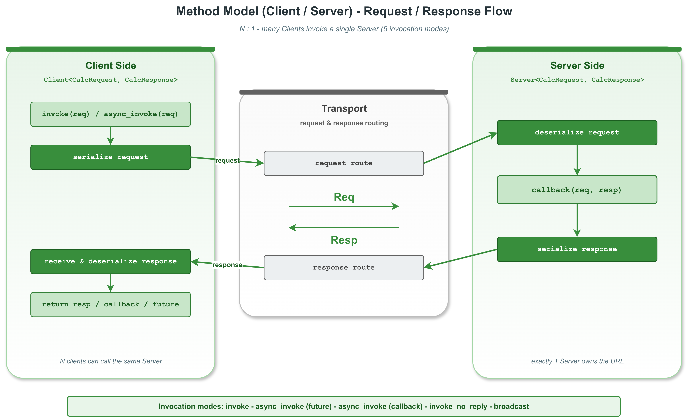

# Hello RPC -- VLink 方法模型入门（计算器服务）

## 概述

本示例演示 VLink 的 **方法模型 (Method Model)**，即 RPC（远程过程调用）模式。通过一个计算器服务场景，展示 `Server` 注册处理函数、`Client` 发送请求并接收响应的完整流程。

本示例拆分为**两个独立程序**：
- **calculator_server** -- 服务端，提供计算器 RPC 服务和通知服务
- **calculator_client** -- 客户端，演示全部 **5 种调用模式**

### 架构图



```
┌──────────────────────┐                    ┌───────────────────────────┐
│  calculator_client   │                    │   calculator_server       │
│                      │   invoke(req)      │                           │
│  Client<Req,Resp> ──>│ =================> │  Server<Req,Resp>         │
│                      │                    │    └─ listen(req, resp)   │
│  auto resp = ...  <──│ <================= │       resp.result = ...   │
│                      │   response         │                           │
└──────────────────────┘                    └───────────────────────────┘
           intra://hello/calculator
```

## 文件结构

| 文件 | 说明 |
|------|------|
| `calculator_types.h` | 共享 POD 请求/响应结构体和 URL 常量 |
| `calculator_server.cc` | 主程序：Server 端，提供计算器和通知服务 |
| `calculator_client.cc` | 主程序：Client 端，演示 5 种调用模式 |
| `CMakeLists.txt` | 构建两个可执行文件 |

## 5 种调用模式对比

| 模式 | API | 阻塞 | 返回值 | 适用场景 |
|------|-----|------|--------|---------|
| 1. 引用输出 | `invoke(req, resp)` | 是 | `bool` | 最常用，简单同步调用 |
| 2. Optional | `invoke(req)` | 是 | `optional<Resp>` | 函数式风格，无需预创建 resp |
| 3. 回调 | `invoke(req, callback)` | 否 | `bool` | 非阻塞，响应到达时回调 |
| 4. Future | `async_invoke(req)` | 否 | `future<Resp>` | 并行发起多个请求 |
| 5. Fire-and-forget | `send(req)` | 否 | `bool` | 无需响应的单向通知 |

## POD 类型定义

```cpp
// calculator_types.h
struct CalcRequest {
  int a;        // Left operand
  int b;        // Right operand
  char op;      // '+', '-', '*', '/'
  char pad[3];  // Padding for consistent layout
};

struct CalcResponse {
  int result;   // Computation result
};
```

**重要**：POD 结构体不能使用默认成员初始化器（如 `int result{0};`）。VLink 使用 `kStandardType` 序列化器，通过 `memcpy` 直接传输 POD 数据，零序列化开销。

`pad[3]` 字段是为了保证 `CalcRequest` 在不同编译器/平台上具有一致的内存布局。

## 关键代码逐步解析

### 1. calculator_server.cc -- 服务端

#### 创建 Server 并注册处理函数

```cpp
Server<example::CalcRequest, example::CalcResponse> server(example::kCalculatorUrl);
server.attach(&server_loop);

server.listen([](const example::CalcRequest& req, example::CalcResponse& resp) {
    switch (req.op) {
      case '+': resp.result = req.a + req.b; break;
      case '-': resp.result = req.a - req.b; break;
      case '*': resp.result = req.a * req.b; break;
      case '/': resp.result = (req.b != 0) ? (req.a / req.b) : 0; break;
      default:  resp.result = 0; break;
    }
});
```

- `Server<ReqT, RespT>` 的 `listen()` 接受签名为 `void(const ReqT&, RespT&)` 的回调
- 回调中读取请求 (`req`)，填充响应 (`resp`)
- 回调返回后，框架自动序列化 `resp` 并发回给 Client
- `attach(&server_loop)` 将处理回调调度到 loop 线程上执行

#### 创建 Fire-and-forget 通知服务

```cpp
Server<example::CalcRequest> notify_server(example::kNotifyUrl);
notify_server.listen([](const example::CalcRequest& req) {
    // 只接收请求，无需返回响应
});
```

当 `Server` 的模板参数只有 `ReqT`（不指定 `RespT`，默认为 `Traits::EmptyType`）时，`listen()` 接受 `void(const ReqT&)` 签名的回调。

#### 信号处理与持续运行

```cpp
std::atomic<bool> running{true};
Utils::register_terminate_signal([&running](int sig) { running = false; });

while (running) {
    std::this_thread::sleep_for(100ms);
}
```

服务端通常持续运行，直到收到 SIGINT (Ctrl+C) 或 SIGTERM 信号。

### 2. calculator_client.cc -- 客户端

#### 模式 1：同步引用输出

```cpp
example::CalcRequest req{10, 3, '+'};
example::CalcResponse resp{};
bool ok = client.invoke(req, resp);
// resp.result == 13
```

最直观的调用方式。`invoke()` 阻塞当前线程，等待服务端响应。默认超时为 `Timeout::kDefaultInterval`。返回 `true` 表示成功收到响应。

#### 模式 2：Optional 返回

```cpp
auto result = client.invoke(req);  // -> std::optional<CalcResponse>
if (result.has_value()) {
    // result->result 即为计算结果
}
```

更简洁的同步调用方式。不需要预创建 `resp` 对象。超时或错误时返回 `std::nullopt`。

#### 模式 3：异步回调

```cpp
client.invoke(req, [](const example::CalcResponse& resp) {
    // 在传输线程上异步调用
});
```

调用立即返回，不阻塞。当服务端响应到达时，回调在传输线程（或 attach 的 MessageLoop）上执行。

#### 模式 4：Future 异步

```cpp
auto future = client.async_invoke(req);
// ... 做其他工作 ...
example::CalcResponse resp = future.get();  // 需要结果时再阻塞
```

返回 `std::future<CalcResponse>`。适合并行发起多个请求，最后统一收集结果。

#### 模式 5：Fire-and-forget

```cpp
Client<example::CalcRequest> notify_client(example::kNotifyUrl);
notify_client.send(req);
```

使用不带 `RespT` 的 `Client`，调用 `send()` 而非 `invoke()`。请求发送后立即返回，不等待响应。适合日志通知、心跳等无需确认的场景。

## Server 的三种监听模式

| 模式 | API | 说明 |
|------|-----|------|
| Fire-and-forget | `listen(ReqCallback)` | `RespT` 必须为 `EmptyType` |
| 同步响应 | `listen(ReqRespCallback)` | 在回调中填充 resp，框架自动返回 |
| 异步响应 | `listen_for_reply(ReqAsyncRespCallback)` | 回调获取 `req_id`，稍后调用 `reply(req_id, resp)` |

## 编译与运行

```bash
# 编译两个目标
cmake --build . --target example_calculator_server
cmake --build . --target example_calculator_client

# 运行 Server（先启动，保持运行）
./output/bin/example_calculator_server

# 在另一个终端运行 Client（需要 shm:// 或 dds:// 传输）
./output/bin/example_calculator_client
```

> **注意**：使用 `intra://` 传输时，server 和 client 必须在同一进程内。
> 跨进程部署需要切换到 `shm://` 或 `dds://`。

## 预期输出

### calculator_server 输出
```
[I] === VLink Calculator Server ===
[I] [Server] Calculator service listening on intra://hello/calculator
[I] [Server] Notification service listening on intra://hello/notify
[I] [Server] Ready -- waiting for client requests (Ctrl+C to stop)...
[I] [Server] 10 + 3 = 13
[I] [Server] 20 * 4 = 80
[I] [Server] 15 - 7 = 8
[I] [Server] 100 / 5 = 20
[I] [NotifyServer] Fire-and-forget received: 42 ! 0
```

### calculator_client 输出
```
[I] === VLink Calculator Client ===
[I] [Client] Connected to intra://hello/calculator
[I] --- Mode 1: invoke(req, resp) ---
[I] [Client] 10 + 3 = 13
[I] --- Mode 2: invoke(req) -> optional ---
[I] [Client] 20 * 4 = 80
[I] --- Mode 3: invoke(req, callback) ---
[I] [Client] 15 - 7 = 8 (via callback)
[I] --- Mode 4: async_invoke(req) -> future ---
[I] [Client] 100 / 5 = 20 (via future)
[I] --- Mode 5: send(req) fire-and-forget ---
[I] [Client] Fire-and-forget send: accepted
[I] === Calculator Client complete ===
```

## 与其他模型的关系

| 模型 | 原语 | 通信方向 | 特点 |
|------|------|----------|------|
| 事件模型 | Publisher / Subscriber | 单向 | 消息广播，不保留历史 |
| 字段模型 | Setter / Getter | 单向 + 缓存 | 状态同步，保留最新值 |
| 方法模型 | Server / Client | 双向 | 请求/响应，支持多种异步模式 |

三种模型可以在同一应用中混合使用，共享相同的传输基础设施。只需修改 URL 中的 transport 字段即可切换底层传输协议。

## 扩展思考

- **超时控制**：`invoke()` 默认使用 `Timeout::kDefaultInterval`，可以通过第三个参数自定义超时时间
- **异步响应**：服务端可以使用 `listen_for_reply()` 实现异步处理，适合耗时操作
- **跨进程**：将 URL 改为 `shm://` 或 `dds://`，即可实现真正的跨进程 RPC 调用
- **负载均衡**：多个 Server 监听同一 URL 时，Client 的请求会被分发到其中一个 Server

## 相关文档

详细原理参见 [doc/04-method-model.md](../../../doc/04-method-model.md)。
