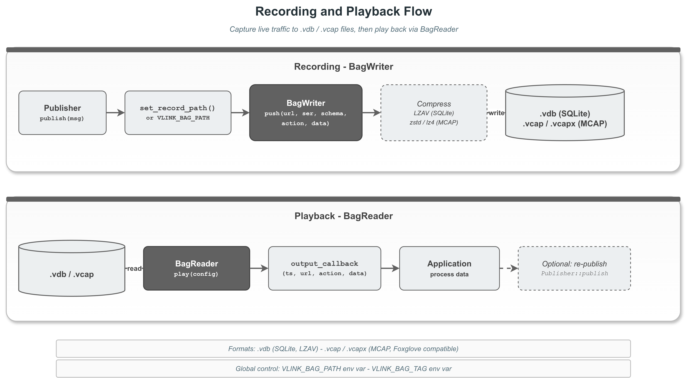

# record_basic — vlink 录制入门：`set_record_path()` 与 `VLINK_BAG_PATH`

本示例是 vlink 录制系统最简形态：在 Publisher/Subscriber 等通信原语上调一行 `set_record_path("/tmp/x.vdb")`，所有上下行消息就被自动写入 bag 文件。也演示如何通过环境变量 `VLINK_BAG_PATH` 一次性把全进程所有消息录到同一个 bag。

读完本示例你能掌握：

- 节点级录制最简代码：1 行 API、不改业务逻辑。
- 全局录制 + tag 标签的用法。
- 三种通信模型（Event / Method / Field）的录制对照。
- 怎么用 `BagWriter::global_get()` 探测全局 writer 状态。

## 背景与适用场景

适用：

- 长跑业务录制：感知 / 规划 / 控制模块的全部输入输出。
- 回归测试：录一段真实数据，离线回放跑业务代码。
- 问题复现：把出错前后几分钟的数据保存下来送给开发者。

不适合：

- 实时监控（用 ProxyAPI，见 `../proxy/`）。
- 录制频率极高的小消息（每秒上百万次）—— bag 文件写入会成为瓶颈。

录制内容包含：URL、类型名、SchemaType、ActionType（publish / setter set / server request / client response 等）、原始 Bytes、时间戳。回放时按时序重放，附带原始 URL 和 schema 信息。

## 核心 API

| API | 签名 | 说明 |
|-----|------|------|
| `Publisher<T>::set_record_path` | `void set_record_path(const std::string& path)` | 节点级录制；空串关闭 |
| `Subscriber<T>::set_record_path` | 同上 | |
| `Server<Req,Resp>::set_record_path` | 同上 | |
| `Client<Req,Resp>::set_record_path` | 同上 | |
| `Setter<T>::set_record_path` | 同上 | |
| `Getter<T>::set_record_path` | 同上 | |
| `BagWriter::global_get` | `static BagWriter* global_get()` | 探测全局 writer（由 `VLINK_BAG_PATH` 创建） |
| 环境变量 `VLINK_BAG_PATH` | path | 启动时自动创建全局 BagWriter |
| 环境变量 `VLINK_BAG_TAG` | string | 给 bag 加 tag |

## 代码导读

### 1. 节点级录制

```cpp
vlink::Publisher<std::string> pub("dds://example/topic");
pub.set_record_path("/tmp/pub_record.vdb");

vlink::Subscriber<std::string> sub("dds://example/topic");
sub.set_record_path("/tmp/sub_record.vdb");
sub.listen([](const std::string& msg) { VLOG_I("got: ", msg); });

pub.wait_for_subscribers();
pub.publish("hello");
```

两个独立的 vdb 文件分别记录 Publisher 输出和 Subscriber 输入。

### 2. 全局录制

```cpp
// 通过环境变量启动：
// VLINK_BAG_PATH=/tmp/global.vdb ./example_record_basic

auto* writer = vlink::BagWriter::global_get();
if (writer) {
  VLOG_I("global writer present");
}
```

`VLINK_BAG_PATH` 不为空时，vlink 自动创建全局 writer；所有节点（不论是否显式 set_record_path）的消息都被汇集到这个全局 bag。

### 3. tag 标签

```cpp
// VLINK_BAG_PATH=/tmp/global.vdb VLINK_BAG_TAG=test_session_001 ./example
```

tag 写入 bag 元信息，用于事后过滤、关联实验编号、版本号等。

### 4. Server/Client 录制

```cpp
vlink::Server<Req, Resp> server(url);
server.set_record_path("/tmp/rpc_record.vdb");
server.listen([](const Req& req, Resp& resp) { /* ... */ });

vlink::Client<Req, Resp> client(url);
client.set_record_path("/tmp/rpc_record.vdb");
client.invoke(...);
```

同一个 path 多个节点共享 → 同一 bag 文件按 URL 区分记录。

### 5. Setter/Getter 录制

```cpp
vlink::Setter<int> setter(url);
setter.set_record_path("/tmp/field_record.vdb");
setter.set(42);

vlink::Getter<int> getter(url);
getter.set_record_path("/tmp/field_record.vdb");
```

## 运行

```bash
# 默认：每节点独立录制
./build/output/bin/example_record_basic

# 全局录制：
VLINK_BAG_PATH=/tmp/global_record.vdb ./build/output/bin/example_record_basic

# 带 tag：
VLINK_BAG_PATH=/tmp/global_record.vdb VLINK_BAG_TAG=test_session \
  ./build/output/bin/example_record_basic
```

预期产物：

```
/tmp/pub_record.vdb        # Publisher 录制
/tmp/sub_record.vdb        # Subscriber 录制
/tmp/rpc_record.vdb        # Server + Client
/tmp/field_record.vdb      # Setter + Getter
/tmp/global_record.vdb     # 全局（若设了 VLINK_BAG_PATH）
```

事后用 `record_bag/` 示例的 BagReader 回放：

```cpp
auto reader = vlink::BagReader::create("/tmp/pub_record.vdb");
reader->register_output_callback([](int64_t ts, const std::string& url, ...) { /* ... */ });
reader->play({});
```

## 常见陷阱

1. **set_record_path 后忘 init**：node 在构造时（kWithInit 默认）已经 init；record_path 在 init 后再设可能不生效，按实现细节。建议构造前或构造直后立即调。
2. **path 跨进程共享**：同一 path 多进程同时写 vdb（SQLite）可能冲突；全局 writer 是进程内共享，跨进程要各自 path。
3. **bag 文件未关闭**：BagWriter 在进程退出时 flush；非正常退出（kill -9）可能丢尾部数据。
4. **VLINK_BAG_PATH + 节点 set_record_path 同时设**：节点路径优先；不会重复写。
5. **回放时 schema 不可用**：消息按 Bytes 形式存储；要解码必须订阅时知道 `T`。

## 设计要点

- 录制是异步的：内部 BagWriter 是 MessageLoop 派生类，push 投递到内部队列后立即返回。
- 写入是 batch + WAL（vdb）；性能高但增加几 ms 延迟。
- VLINK_BAG_PATH 是 process-wide singleton；跨线程安全。

## 配图



图中展示节点 → BagWriter → 文件的录制数据流。

## 参考

- `../record_bag/` — 直接 BagWriter / BagReader API
- `../record_mcap/` — MCAP 格式
- `../record_compression/` — 压缩对比
- 顶层 `doc/12-bag-recording.md` — 录制系统完整章节
- 顶层 `doc/21-environment-vars.md` — `VLINK_BAG_PATH` / `VLINK_BAG_TAG`
