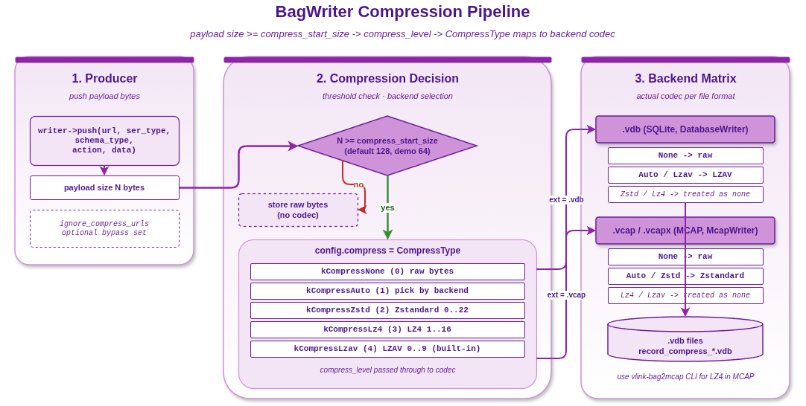

# 录制压缩对比示例



## 1. 概述

本示例对比 VLink BagWriter 在 SQLite（`.vdb`）后端下不同压缩枚举的写入表现。注意：`.vdb` 后端实际只启用 LZAV 压缩，其他枚举值（Zstd / LZ4）在 SQLite 路径被视为不压缩，详见 [doc/12-bag-recording.md](../../../doc/12-bag-recording.md)。

## 2. 压缩枚举

| 枚举 | 值 | SQLite（`.vdb`）实际效果 |
|------|-----|------|
| `kCompressNone` | 0 | 不压缩 |
| `kCompressAuto` | 1 | 走 LZAV |
| `kCompressZstd` | 2 | 不压缩（枚举在 SQLite 路径被忽略） |
| `kCompressLz4`  | 3 | 不压缩（枚举在 SQLite 路径被忽略） |
| `kCompressLzav` | 4 | 走 LZAV |

## 3. 配置参数

```cpp
BagWriter::Config config;
config.compress = BagWriter::CompressType::kCompressLzav;
config.compress_level = 3;          // 算法特定的压缩级别
config.compress_start_size = 64;     // 仅压缩 >= 64 字节的负载
```

| 参数 | 描述 |
|------|------|
| `compress` | 压缩算法枚举 |
| `compress_level` | 压缩级别（Zstd: 0-22, LZ4: 1-16, LZAV: 0-9） |
| `compress_start_size` | 最小压缩阈值（字节），小于此值不压缩 |

## 4. 选择指南（`.vdb` 后端）

| 场景 | 推荐枚举 | 说明 |
|------|------|------|
| 实时录制，CPU 敏感 | `kCompressNone` | 完全不压缩，最低开销 |
| 通用/存储受限 | `kCompressLzav` 或 `kCompressAuto` | `.vdb` 后端下两者都走 LZAV |

如需走 Zstandard 压缩，请在 `BagWriter::Config` 中选择 `.vcap`/`.vcapx`（MCAP）后端并设置 `kCompressAuto` 或 `kCompressZstd`。

## 5. 编译与运行

```bash
cd build
cmake .. && make example_record_compression
./output/bin/example_record_compression
```

输出文件保存在 `/tmp/record_compress_*.vdb`。

## 6. 注意事项

- 压缩效果取决于数据的可压缩性
- 随机数据几乎不可压缩，重复模式数据压缩效果好
- `compress_start_size` 避免对小消息产生压缩开销
- LZAV 是 VLink 内置实现，无需额外依赖
- `.vdb`（SQLite）后端只走 LZAV；若需 Zstandard，请使用 `.vcap`/`.vcapx`（MCAP）后端
