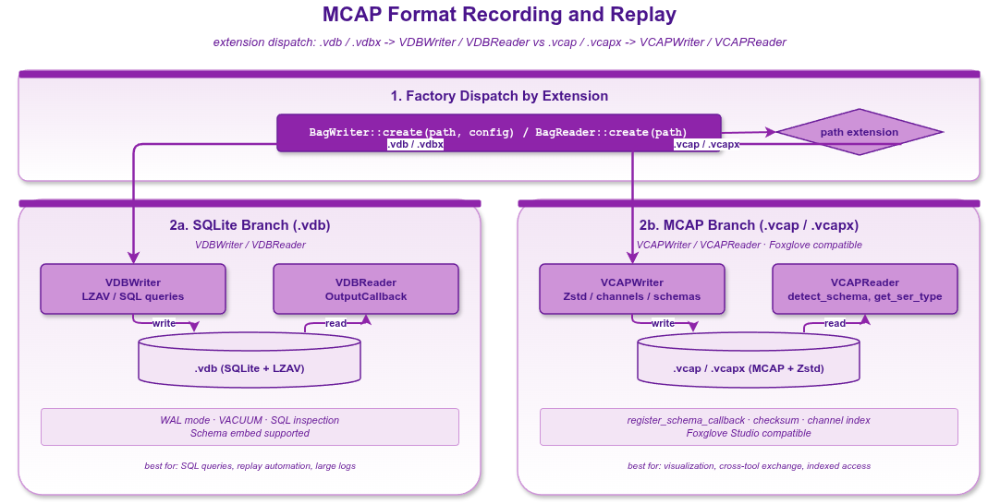

# VLink MCAP 格式录制示例



## 1. 概述

本示例演示了使用 MCAP 格式进行消息录制和回放。MCAP（Message Capture Archive Protocol）是一种模块化、索引化的二进制文件格式，专为高效随机访问回放而设计。

VLink 同时支持 SQLite（`.vdb`）和 MCAP（`.vcap`/`.vcapx`）两种录制格式。MCAP 格式的主要优势包括：

- **跨平台兼容**：可被 Foxglove Studio 等第三方可视化工具直接打开
- **索引化存储**：支持按通道和时间戳快速定位
- **Schema 嵌入**：可在文件中嵌入 protobuf 或 flatbuffers schema，支持离线反序列化
- **校验和支持**：提供数据完整性验证
- **多压缩编解码器**：支持 Zstd、LZ4、LZAV 等压缩算法

## 2. 格式选择

VLink 通过文件扩展名自动选择录制格式：

| 扩展名 | 格式 | Writer 实现 | Reader 实现 |
|--------|------|------------|------------|
| `.vcap` | MCAP | `VCAPWriter` | `VCAPReader` |
| `.vcapx` | MCAP | `VCAPWriter` | `VCAPReader` |
| `.vdb` / `.vdbx` | SQLite | `VDBWriter` | `VDBReader` |

## 3. 创建 MCAP 文件

### 3.1 方式一：通过工厂方法（推荐）

```cpp
// 文件扩展名为 .vcap，自动使用 VCAPWriter
auto writer = BagWriter::create("/tmp/recording.vcap");
writer->async_run();
writer->push("dds://my/topic", "raw", SchemaType::kRaw, ActionType::kPublish, data);
```

### 3.2 方式二：显式构造

```cpp
auto writer = std::make_shared<VCAPWriter>("/tmp/recording.vcap", config);
writer->async_run();
```

两种方式的 API 完全一致，区别仅在于工厂方法自动根据扩展名选择实现。

## 4. VCAPWriter 特性

`VCAPWriter` 继承 `BagWriter` 的全部配置和能力，包括：

### 4.1 压缩支持

```cpp
BagWriter::Config config;
config.compress = BagWriter::CompressType::kCompressZstd;
config.compress_level = 5;
```

MCAP 格式下，BagWriter 路径实际只启用 Zstandard 压缩：

| 枚举 | MCAP 路径实际效果 |
|------|-------------------|
| `kCompressNone` | 不压缩 |
| `kCompressAuto` | 走 Zstandard |
| `kCompressZstd` | 走 Zstandard |
| `kCompressLz4`  | 枚举在此路径被视为不压缩 |
| `kCompressLzav` | 枚举在此路径被视为不压缩 |

> 若需 MCAP 文件启用 LZ4，请使用独立 CLI 工具 `vlink-bag2mcap`（支持 `--compression none|lz4|zstd`），它直接写 MCAP，不走 BagWriter。

### 4.2 文件分割

```cpp
BagWriter::Config config;
config.split_by_size = 1024 * 1024 * 100;  // 每 100MB 分割
config.split_name_by_time = true;           // 文件名包含时间戳
```

分割后的文件命名格式：`recording_20260328_143025.vcap`、`recording_20260328_143125.vcap` 等。

### 4.3 Schema 嵌入

MCAP 支持在文件中嵌入 schema，使得回放时无需原始 `.proto` / `.fbs` 文件即可反序列化消息：

```cpp
writer->register_schema_callback(
    [](const std::string& ser_type, SchemaType schema_type) -> SchemaData {
        SchemaData schema;
        schema.name = ser_type;
        schema.schema_type = schema_type;
        schema.encoding = std::string(SchemaData::convert_type(schema_type));
        // schema.data = ...;
        return schema;
    });
```

## 5. 读取 MCAP 文件

### 5.1 通过工厂方法

```cpp
auto reader = BagReader::create("/tmp/recording.vcap");
```

### 5.2 显式构造

```cpp
auto reader = std::make_shared<VCAPReader>("/tmp/recording.vcap");
```

### 5.3 查看文件元数据

```cpp
const auto& info = reader->get_info();
// info.storage_type: "mcap"
// info.compression_type: 使用的压缩算法
// info.message_count: 消息总数
// info.url_metas: 每个 URL 的统计信息
```

### 5.4 查询 URL 的序列化类型

```cpp
std::string ser = reader->get_ser_type("dds://my/topic");
// 返回 "demo.proto.PointCloud"、"raw" 等
```

### 5.5 提取嵌入的 Proto Schema

```cpp
auto schemas = reader->detect_schema();
for (const auto& schema : schemas) {
    // schema.encoding: "protobuf"
    // schema.schema_type: SchemaType::kProtobuf
    // schema.name: 消息类型全名
    // schema.data: 二进制 FileDescriptorSet
}
```

## 6. VCAPReader 回放控制

`VCAPReader` 继承了 `BagReader` 的全部回放控制能力：

```cpp
reader->async_run();

BagReader::Config config;
config.rate = 2.0;           // 2 倍速
config.times = BagReader::kInfinite;  // 无限循环
config.filter_urls.insert("dds://my/topic");  // 只回放指定 URL
reader->play(config);

// 控制
reader->pause();
reader->resume();
reader->jump(5000, 1.0, 1);  // 跳转到 5 秒处
reader->stop();
```

## 7. .vcap 与 .vcapx 的区别

两种扩展名在当前实现中均使用 `VCAPWriter`/`VCAPReader`。`.vcap` 是单文件 MCAP；`.vcapx` 是 split 模式的 manifest 文件，内部引用实际写出的 `.vcap` 分片。需要按大小或时间切分时，输出路径必须使用 `.vcapx`。

## 8. MCAP 与 SQLite 格式对比

| 特性 | MCAP (.vcap) | SQLite (.vdb) |
|------|-------------|---------------|
| 第三方工具支持 | Foxglove Studio 等 | 通用 SQLite 浏览器 |
| 随机访问性能 | 优秀（内置索引） | 优秀（SQL 查询） |
| Schema 嵌入 | 原生支持 | 支持 |
| 文件修复 | 支持 | 支持（WAL 模式更强） |
| 压缩支持 | 全部支持 | 全部支持 |
| 文件分割 | 支持 | 支持 |
| 写入性能 | 高 | 高（WAL 模式更优） |

## 9. 编译和运行

```bash
cmake -B build -S . -DCMAKE_PREFIX_PATH=/path/to/vlink/install
cmake --build build --target example_record_mcap
./build/output/bin/example_record_mcap
```

## 10. 输出文件

| 文件 | 说明 |
|------|------|
| `/tmp/mcap_auto.vcap` | 通过工厂方法创建的 MCAP 文件 |
| `/tmp/mcap_explicit.vcap` | 显式构造 + Zstd 压缩 |
| `/tmp/mcap_split.vcapx` | split manifest，引用实际写出的 `.vcap` 分片 |

## 11. 最佳实践

1. **需要 Foxglove 兼容时使用 MCAP**：如果需要用 Foxglove Studio 可视化数据，选择 `.vcap` 扩展名
2. **需要 SQL 查询时使用 SQLite**：如果需要对录制数据进行复杂查询，选择 `.vdb` 扩展名
3. **嵌入 Schema**：注册 `SchemaCallback` 以在 MCAP 文件中嵌入 schema 数据，方便离线分析
4. **合理配置压缩**：MCAP 格式下推荐使用 `kCompressZstd` 以获得最佳压缩比与兼容性
