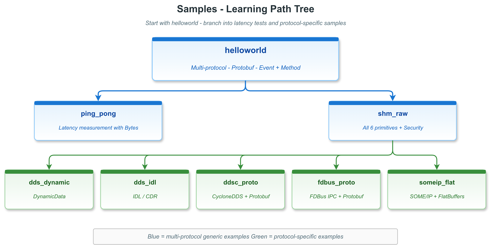

# samples — 围绕具体传输协议的端到端示例

`samples/` 下每个子目录针对一个或多个具体传输后端做完整可运行示例。默认 vlink 构建（`ENABLE_EXAMPLES=ON` 不带 `ENABLE_EXAMPLES_ALL`）只编译这一组，因为这里的示例代表"真实可部署"的最小工程。

## 子示例索引

| 示例 | 传输 | 序列化 | 模型 | 进程模式 | 依赖 |
|------|------|--------|------|---------|------|
| [helloworld](helloworld/) | 多后端可切换（dds / ddsc / shm / someip / fdbus / qnx） | Protobuf | Method + Event | 多进程（server + client） | Protobuf + 对应后端 |
| [ping_pong](ping_pong/) | 同上 | Bytes（raw） | Event（双向） | 多进程 | 对应后端 |
| [shm_raw](shm_raw/) | `shm://` | Bytes | Method + Event + Field + Security | 单进程 | Iceoryx |
| [dds_dynamic](dds_dynamic/) | `dds://` | DynamicData + Protobuf | Method + Event | 单进程 | FastDDS + Protobuf |
| [dds_idl](dds_idl/) | `dds://` | FastDDS IDL（CDR） | Method + Event | 单进程 | FastDDS + IDL 工具链 |
| [ddsc_proto](ddsc_proto/) | `ddsc://` | Protobuf | Method + Event | 单进程 | CycloneDDS + Protobuf |
| [fdbus_proto](fdbus_proto/) | `fdbus://` | Protobuf | Method + Event + Field | 单进程 | FDBus + Protobuf |
| [someip_flat](someip_flat/) | `someip://` | FlatBuffers | Method + Event + Field | 单进程 | vsomeip + FlatBuffers |
| [pub_sub_fbs](pub_sub_fbs/) | `ddsc://` | FlatBuffers | Event | 多进程（pub + sub） | CycloneDDS + FlatBuffers |

`dds_idl` 在 `CMakeLists.txt` 默认被注释禁用（依赖 FastDDS 的 `fastddsgen` IDL 工具链）；按需手动启用。

## 共享 helper

`common_transport.h` 提供 `Common::get_transport_url(env_var, transport_env, topic, someip_url="")`：根据环境变量返回对应传输的 URL，统一处理 6 种传输的 URL 形式。

`helloworld/helloworld_common.h` 与 `ping_pong/ping_pong_common.h` 都是它的薄包装，分别暴露 `get_method_url` / `get_event_url` / `get_ping_url` / `get_pong_url`。

## 环境变量

helloworld 与 ping_pong 通过环境变量切换传输：

| 示例 | 变量 | 取值 | 默认 |
|------|------|------|------|
| helloworld | `METHOD_TRANSPORT` / `EVENT_TRANSPORT` | `dds` / `ddsc` / `shm` / `someip` / `fdbus` / `qnx` | `dds` |
| helloworld | `METHOD_URL` / `EVENT_URL` | 完整 URL | 未设（覆盖 TRANSPORT） |
| ping_pong | `PING_TRANSPORT` / `PONG_TRANSPORT` | 同上 | `dds` |
| ping_pong | `PING_URL` / `PONG_URL` | 完整 URL | 未设 |

## 各后端前置守护进程

| 后端 | 守护进程 |
|------|---------|
| `dds://` / `ddsc://` | 无 |
| `shm://` | `iox-roudi`（Iceoryx RouDi） |
| `someip://` | `vsomeipd`（vsomeip routing manager） |
| `fdbus://` | `fdb_name_server` |
| `mqtt://` | MQTT broker（如 Mosquitto） |
| `qnx://` | 无（要求 QNX OS） |

## 构建

```bash
cd /work/vlink
cmake -DCMAKE_BUILD_TYPE=Release -DENABLE_EXAMPLES=ON -B build -S .
cmake --build build -j$(nproc)
ls build/output/bin/sample_*
```

缺少依赖的 sample 自动跳过（CMakeLists 用 `find_package` + `return()` 守卫）；不会让全量构建失败。

## 推荐阅读顺序

1. **`helloworld/`** —— 必看。API 覆盖最广、可切换 6 种后端。
2. **`ping_pong/`** —— Bytes + 延迟测量。
3. **`shm_raw/`** —— shm 后端 + Security + 六种通信原语全集。
4. **`ddsc_proto/`** —— 最简 CycloneDDS + Protobuf。
5. **`dds_dynamic/`** —— DynamicData 单话题多类型。
6. **`fdbus_proto/`** —— FDBus IPC + 三种模型。
7. **`pub_sub_fbs/`** —— FlatBuffers 标准用法（UserT vs User*）。
8. **`someip_flat/`** —— SOME/IP 汽车场景。
9. **`dds_idl/`** —— FastDDS IDL 类型（启用 IDL 工具链后）。

## 配图



图中展示 9 个 sample 在传输 / 序列化 / 模型三个维度的覆盖关系。

## 参考

- 顶层 `examples/README.md` —— 总览
- 顶层 `doc/22-examples.md` —— samples 章节
- `vlink/include/vlink/modules/` —— 各传输模块头文件
