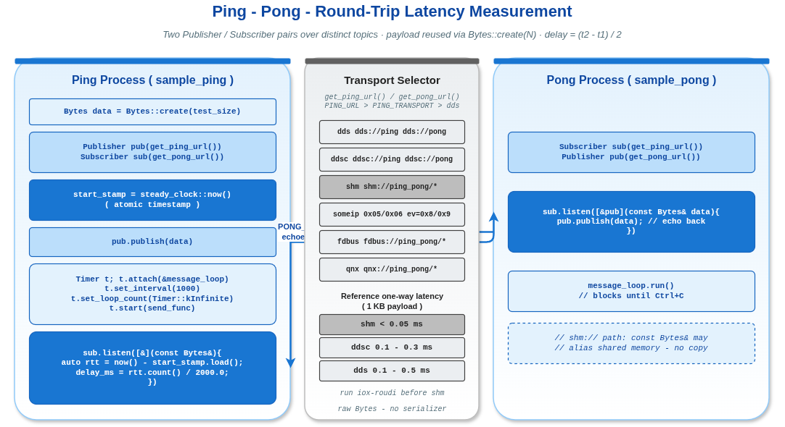

# ping_pong -- VLink 往返延迟测量示例

## 1. 概述

本示例通过经典的 Ping-Pong 模式测量 VLink 通信的往返延迟（Round-Trip Time, RTT）。Ping 端发送数据包并记录时间戳，Pong 端收到后立即原样回传，Ping 端根据回传时间计算单程延迟。

本示例使用原始字节（`Bytes`）类型通信，**不依赖任何序列化框架**（无 Protobuf/FlatBuffers），是最纯粹的传输层性能测量工具。支持通过命令行参数配置负载大小，通过环境变量切换传输协议。



---

## 2. 目录结构

```
ping_pong/
  CMakeLists.txt         -- 顶层构建配置
  ping_pong_common.h     -- 公共配置：URL 定义 + 环境变量读取逻辑
  ping/
    CMakeLists.txt       -- Ping 端构建配置
    ping.cc              -- Ping 端：发送数据 + 计算延迟
  pong/
    CMakeLists.txt       -- Pong 端构建配置
    pong.cc              -- Pong 端：接收数据 + 原样回传
```

---

## 3. 工作原理

```
  Ping 端                                Pong 端
  ┌──────────┐    Publisher<Bytes>     ┌──────────┐
  │          │ ───── ping 数据 ──────> │          │
  │  记录 t1 │                         │  收到后  │
  │          │ <──── pong 数据 ─────── │  立即回传 │
  │  记录 t2 │    Subscriber<Bytes>    │          │
  │          │                         │          │
  │ 延迟 =   │                         └──────────┘
  │(t2-t1)/2 │
  └──────────┘
```

Ping 端使用两个通信原语：`Publisher<Bytes>` 发送 ping 消息到一个话题，`Subscriber<Bytes>` 订阅另一个话题接收 pong 回复。Pong 端则反过来：订阅 ping 话题，发布到 pong 话题。通过使用不同的话题避免自己收到自己的消息。

---

## 4. Ping 端代码分析（ping.cc）

### 4.1 可配置负载大小

```cpp
uint64_t test_size = 1024;  // 默认 1024 字节

if (argc == 2) {
    std::string str(argv[1]);
    auto [p, error] = std::from_chars(str.data(), str.data() + str.size(), test_size);
    if (error != std::errc()) {
        VLOG_W("Invalid args.");
        return 1;
    }
}
```

使用 C++17 的 `std::from_chars` 解析命令行参数，比 `std::stoi` 更高效且无异常开销。负载大小直接影响传输延迟，可用于测试不同数据量下的性能表现。

### 4.2 延迟计算核心

```cpp
// 原子变量记录发送时间戳，确保 Timer 回调线程和 Subscriber 回调线程的安全访问
std::atomic<std::chrono::steady_clock::time_point> start_stamp = std::chrono::steady_clock::now();

sub.listen([&start_stamp](const Bytes&) {
    auto duration =
        std::chrono::duration_cast<std::chrono::microseconds>(
            std::chrono::steady_clock::now() - start_stamp.load());
    // 往返时间 / 2 = 单程延迟（毫秒）
    double delay = duration.count() / 2000.0;
    CLOG_D("Delay(ms) = %.3lf.", delay);
});
```

关键设计点：
- 使用 `std::atomic` 保护时间戳：`start_stamp` 在 Timer 回调（MessageLoop 线程）中写入，在 Subscriber 回调（VLink 内部线程）中读取，两个线程并发访问
- 使用 `steady_clock` 而非 `system_clock`：monotonic 时钟不受系统时间调整影响，适合延迟测量
- `duration.count()` 返回微秒数，除以 2000.0 得到单程延迟的毫秒值

### 4.3 预分配与复用

```cpp
Bytes data = Bytes::create(test_size);

auto send_func = [&pub, &data, &start_stamp]() {
    start_stamp = std::chrono::steady_clock::now();
    pub.publish(data);
};

send_func();  // 立即发送第一个 ping

Timer timer;
timer.attach(&message_loop);
timer.set_interval(kTestInterval);       // 每 1000ms
timer.set_loop_count(Timer::kInfinite);
timer.start(send_func);
```

`Bytes::create(test_size)` 预分配指定大小的缓冲区，在整个测量过程中复用同一块内存，避免每次发送时的动态分配开销。这确保测量的是纯传输延迟，而非内存分配延迟。

---

## 5. Pong 端代码分析（pong.cc）

Pong 端的逻辑极其简洁 -- 只做一件事：收到什么就发回什么。

```cpp
Subscriber<Bytes> sub(Common::get_ping_url());
Publisher<Bytes> pub(Common::get_pong_url());

// 收到 ping 立即原样转发
sub.listen([&pub](const Bytes& data) { pub.publish(data); });

message_loop.run();
```

关键点：
- Subscriber 回调中直接调用 `pub.publish(data)` 回传，引入的额外延迟仅为一次函数调用
- `data` 是 `const Bytes&` 引用，在 `shm://` 传输下可能是零拷贝引用（直接引用共享内存）
- Pong 端同样使用 MessageLoop 保持进程运行，通过 Ctrl+C 优雅退出

---

## 6. 环境变量协议切换

`ping_pong_common.h` 与 helloworld 的 `helloworld_common.h` 采用相同的设计模式。

### 6.1 环境变量

| 环境变量 | 说明 | 默认值 |
|----------|------|--------|
| `PING_TRANSPORT` | Ping 话题的传输协议 | `dds` |
| `PONG_TRANSPORT` | Pong 话题的传输协议 | `dds` |
| `PING_URL` | 直接指定 Ping 话题完整 URL（优先级高于 `PING_TRANSPORT`） | 无 |
| `PONG_URL` | 直接指定 Pong 话题完整 URL（优先级高于 `PONG_TRANSPORT`） | 无 |

### 6.2 各协议对应 URL

| 协议 | Ping URL | Pong URL |
|------|----------|----------|
| `dds`（默认） | `dds://ping` | `dds://pong` |
| `ddsc` | `ddsc://ping` | `ddsc://pong` |
| `shm` | `shm://ping_pong/ping` | `shm://ping_pong/pong` |
| `someip` | `someip://0x05/0x06?groups=0x7&event=0x8` | `someip://0x05/0x06?groups=0x7&event=0x9` |
| `fdbus` | `fdbus://ping_pong/ping` | `fdbus://ping_pong/pong` |
| `qnx` | `qnx://ping_pong/ping` | `qnx://ping_pong/pong` |

注意：SOME/IP 的 Ping 和 Pong 使用相同的 Service/Instance ID（0x05/0x06）和事件组（0x7），但通过不同的 Event ID（0x8 vs 0x9）区分两个方向的通信通道。

---

## 7. 构建与运行

```bash
# 构建
cd /work/vlink
cmake -DCMAKE_BUILD_TYPE=Release -B build -S .
cmake --build build -j$(nproc)

# 运行 Pong 端（终端 1）
./build/output/bin/sample_pong

# 运行 Ping 端（终端 2，默认 1024 字节负载）
./build/output/bin/sample_ping

# 自定义负载大小
./build/output/bin/sample_ping 64        # 64 字节（最小延迟测试）
./build/output/bin/sample_ping 65536     # 64KB（中等负载）
./build/output/bin/sample_ping 1048576   # 1MB（大数据量）

# 使用共享内存传输测量零拷贝延迟
iox-roudi &
PING_TRANSPORT=shm PONG_TRANSPORT=shm ./build/output/bin/sample_pong
PING_TRANSPORT=shm PONG_TRANSPORT=shm ./build/output/bin/sample_ping 4096

# 对比不同传输后端的延迟
PING_TRANSPORT=ddsc PONG_TRANSPORT=ddsc ./build/output/bin/sample_pong &
PING_TRANSPORT=ddsc PONG_TRANSPORT=ddsc ./build/output/bin/sample_ping
```

---

## 8. 输出示例

```
Delay(ms) = 0.125.
Delay(ms) = 0.118.
Delay(ms) = 0.132.
```

输出的延迟值为**单程延迟**（往返时间除以 2），单位为毫秒，精度到微秒级（3 位小数）。

### 8.1 性能参考（仅供参考，实际值取决于硬件和系统负载）

| 传输后端 | 负载大小 | 典型单程延迟 |
|----------|---------|-------------|
| `shm://` | 1KB | < 0.05ms |
| `dds://` | 1KB | 0.1 - 0.5ms |
| `ddsc://` | 1KB | 0.1 - 0.3ms |
| `shm://` | 1MB | < 0.1ms（零拷贝） |
| `dds://` | 1MB | 1 - 5ms |

---

## 9. 依赖

- VLink 库（支持所选传输协议的组件）
- 无序列化框架依赖（使用原始 Bytes 类型）

---

## 10. 与 helloworld 的对比

| 特性 | helloworld | ping_pong |
|------|-----------|-----------|
| 通信模型 | Method + Event | Event（双向） |
| 序列化 | Protobuf | Bytes（原始字节） |
| 数据流向 | 单向（Server->Client 或 Pub->Sub） | 双向（Ping->Pong->Ping） |
| 进程数 | 2（Server + Client） | 2（Ping + Pong） |
| 重点演示 | API 用法和协议切换 | 传输性能和延迟测量 |
| 负载配置 | 固定 | 命令行参数可配置 |
