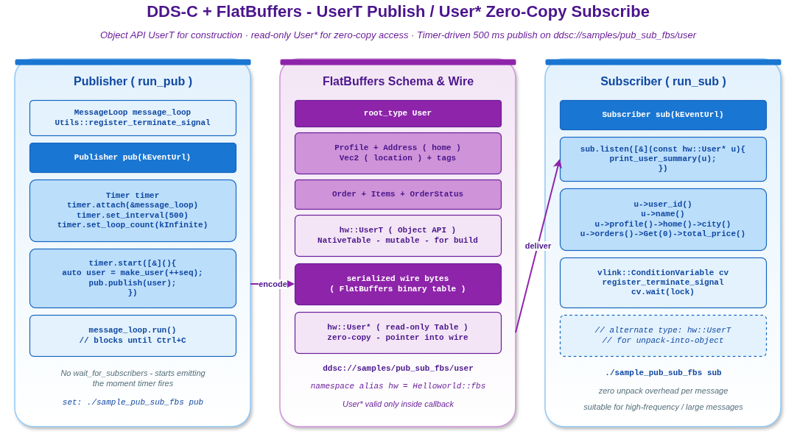

# pub_sub_fbs — DDS-C + FlatBuffers Pub/Sub

事件模型样例，展示 vlink 处理 FlatBuffers 的标准模式：发布端用 Object API（`UserT`），订阅端用零拷贝指针（`User*`）。两种类型的差异：

- `UserT`（NativeTable / Object API）：可读可写的结构体；发布端填充字段后传给 publish，框架自动序列化。
- `User*`（只读 table 指针）：直接指向 wire 缓冲，零拷贝读取；只在回调内有效。

读完本示例你能掌握：

- FlatBuffers 与 vlink 的标准集成。
- `Publisher<UserT>` vs `Subscriber<User*>` 的语义差异。
- `vlink_generate_cpp(FBS ...)` CMake 工具的作用。
- 何时该用 FlatBuffers vs Protobuf。

## 文件结构

```
pub_sub_fbs/
  pub_sub_fbs.cc         # main, 角色由 argv[1] 选择
  fbs/helloworld.fbs     # User / Profile / Order / Item / Vec2 schema
```

## 运行

```bash
# 终端 1
./build/output/bin/sample_pub_sub_fbs sub

# 终端 2（每 500ms 发布一条消息）
./build/output/bin/sample_pub_sub_fbs pub
```

## 核心 API

```cpp
// 订阅端：零拷贝指针
Subscriber<hw::User*> sub("ddsc://samples/pub_sub_fbs/user");
sub.listen([](const hw::User* user) {
  VLOG_I(user->user_id());                       // 指针只在回调内有效
});

// 发布端：Object API（NativeTable）
Publisher<hw::UserT> pub("ddsc://samples/pub_sub_fbs/user");
hw::UserT u;
u.user_id = 1;
u.nickname = "alice";
pub.publish(u);                                  // vlink 自动序列化
```

`hw` 是 `Helloworld` 命名空间的别名（生成代码用 `helloworld.fbs` 的 namespace）。

## 类型对照

| 类型 | 形式 | 用途 |
|------|------|------|
| `hw::UserT` | NativeTable / Object API | 填充 / 修改要发送的值 |
| `hw::User*` | 只读 table 指针 | 零拷贝订阅读取 |

## 演示内容

1. FlatBuffers 被 vlink 自动识别，**不需要**手动 `set_ser_type`。
2. Publisher 立即开始发送，**不需要** `wait_for_subscribers`（FlatBuffers 路径下 DDS-C 提供的语义即可）。
3. 序列号 `seq` 让 user_id / nickname / order 等字段每个周期都变化，订阅端看到的是消息流不是固定包。
4. `User*` 指针只在回调内有效：要长期保留得复制到 `UserT`。

## 何时选 FlatBuffers vs Protobuf

| 维度 | FlatBuffers | Protobuf |
|------|-------------|---------|
| 解析速度 | 零拷贝，~0 | 需要 parse |
| 编码速度 | 中等 | 中等 |
| 文件大小 | 较小 | 较小 |
| 跨语言支持 | 多语言 | 多语言 |
| 工具链生态 | 较少 | 庞大 |
| schema 演进 | 优秀 | 优秀 |
| 大对象（视频、图） | 优秀（零拷贝读） | 一般 |

vlink 同时支持，选其一按工程偏好。

## 依赖

- `vlink::ddsc`（CycloneDDS 后端）
- FlatBuffers
- `vlink_generate_cpp(FBS ${FBS_SRCS})` CMake helper：调用 `flatc` 生成 `helloworld.fbs.hpp`

## 扩展练习

- 把 `ddsc://` 换成 `dds://` 对比两种 DDS 后端。
- 把订阅端改成 `Subscriber<hw::UserT>` 看 unpacked-object 形式（性能略低但拷贝出独立对象）。
- 给 schema 加 Order 字段，观察生成代码 / 用法差异。

## 常见陷阱

1. **`User*` 指针出作用域使用**：UAF；要么 deepcopy 到 UserT，要么处理完就丢。
2. **发布端用 `User*`**：行为按实现可能 error；发布端必须用 NativeTable `UserT`。
3. **schema 不一致**：fbs 文件改了但没重新 generate，新旧字段不兼容。
4. **没启 CycloneDDS**：vlink 编译时缺 `vlink::ddsc` 组件；改 URL 到 `dds://` 走 FastDDS。
5. **大消息 fragmentation**：DDS 默认 MTU 限制；大对象需要调 fragment_size 或换 shm。

## 配图



图中展示 publisher 填 `UserT` → 序列化 → wire → subscriber 零拷贝 `User*` 读取的完整数据通路。

## 参考

- `../helloworld/` — Protobuf 对照
- `../someip_flat/` — FlatBuffers + SOME/IP 后端
- 顶层 `doc/06-serialization.md` — 序列化机制
- `vlink/include/vlink/serializer.h` — Serializer 接口
- FlatBuffers 官方文档 https://flatbuffers.dev/
