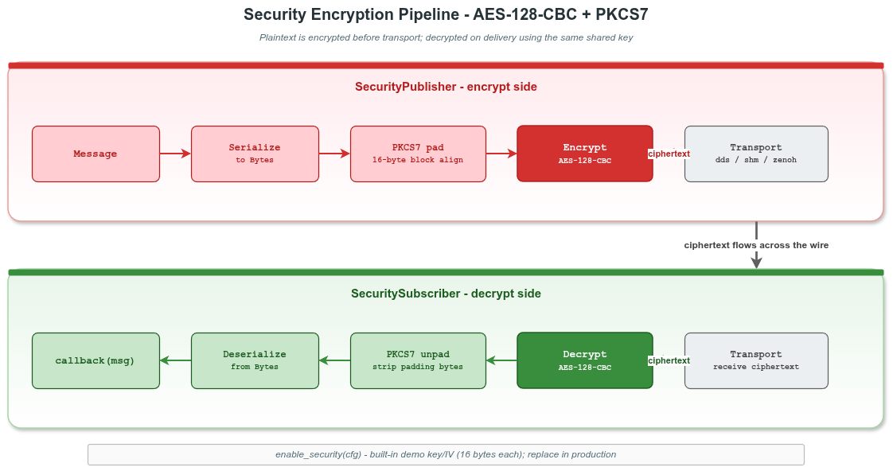

# VLink Security Basic 示例

## 1. 概述

本示例演示 `SecurityPublisher` / `SecuritySubscriber` 的基本用法，覆盖：

1. 使用 `Security::Config::key` 配置对称 AES-128-GCM 加密
2. 在 `SecurityXxx` 构造时通过第二参数一次性传入 `Security::Config`
3. 双端配置不一致时的解密失败行为
4. 加密 `Bytes` 原始字节
5. 安全加密的传输限制



> ⚠️ **传输要求**：`intra://` 与 `dds://` CDR 类型**不**支持安全加密；可用 `shm://`、`shm2://`、`zenoh://`、`mqtt://`、`fdbus://` 等跨进程后端。

## 2. 文件说明

| 文件 | 说明 |
|------|------|
| `security_basic.cc` | 主示例源码，包含 5 个 Section |
| `security_common.h` | 公共辅助函数（打印默认算法、支持的 transport） |
| `CMakeLists.txt` | 构建配置，链接 `vlink::all`（覆盖全后端，含 dds） |

## 3. 构建与运行

```bash
cmake -B build -S . -DCMAKE_PREFIX_PATH=/path/to/vlink/install
cmake --build build --target example_security_basic
./build/output/bin/example_security_basic
```

## 4. 核心 API

```cpp
template <typename T>
class SecurityPublisher : public Publisher<T, SecurityType::kWithSecurity> {
 public:
  template <typename SecurityConfigT = Security::Config>
  explicit SecurityPublisher(const std::string& url_str,
                             SecurityConfigT&& sec_cfg = {},
                             InitType type = InitType::kWithInit);
  // 另有 ConfT 重载与 create_unique / create_shared 工厂方法。
};

template <typename T>
class SecuritySubscriber : public Subscriber<T, SecurityType::kWithSecurity> {
 public:
  template <typename SecurityConfigT = Security::Config>
  explicit SecuritySubscriber(const std::string& url_str,
                              SecurityConfigT&& sec_cfg = {},
                              InitType type = InitType::kWithInit);
};
```

`Security::Config` 是一个 aggregate struct，包含 `key` / `passphrase` / `pbkdf2_salt` /
RSA PEM 字段 / 自定义回调等。本示例只使用 `key`：

```cpp
vlink::Security::Config cfg;
cfg.key = "my-secret";   // 原始对称种子；SHA-256 截断为 AES-128 key

vlink::SecurityPublisher<std::string> pub("shm://secure/topic", cfg);
vlink::SecuritySubscriber<std::string> sub("shm://secure/topic", cfg);
```

| 行为 | 说明 |
|------|------|
| 构造时传 cfg | 一次性安装；运行时不再有 `enable_security()` setter，重新配置请销毁重建节点 |
| 缺省 cfg | 可写 `SecurityXxx(url)` 或 `SecurityXxx(url, {})`，等价于不安装 Security，encrypt/decrypt 始终失败 |
| 双端配置 | 必须等价（相同 `key`，或相同 `passphrase + pbkdf2_salt`） |

## 5. 工作原理

1. **加密**：`SecurityPublisher::publish()` 在发送前对 payload 调用 OpenSSL `EVP_aes_128_gcm()` 加密，wire 上为 `[34B envelope header][N B ciphertext][16B tag]`。
2. **解密**：`SecuritySubscriber` 在分发回调前对收到的 payload 解密；**GCM tag 校验失败时回调不会被触发**（消息被静默丢弃，日志记录）。
3. **密钥派生**：`Config::key` 经 SHA-256 截断为 16 字节 AES-128 key。

## 6. 注意事项

- 双端 `Config` 必须等价；任一端未在 ctor 传 cfg 或使用不同 `key` 时，GCM tag 校验失败、消息被丢弃。
- 若要替换 AEAD 为其它算法（SM4 / ChaCha20 / HSM 等），见 [`../security_custom/`](../security_custom/) 中 `encrypt_callback` / `decrypt_callback` 用法。
- 若要使用 RSA 混合握手（无需预共享对称密钥），见 [doc/09-security.md §9.6](../../../doc/09-security.md#96-非对称模式rsa-混合握手)。

## 7. 相关文档

- [doc/09-security.md](../../../doc/09-security.md) — 完整安全加密章节
- [`../security_custom/`](../security_custom/) — 自定义 encrypt/decrypt 回调
- [`../security_ssl/`](../security_ssl/) — 传输层 SSL/TLS
