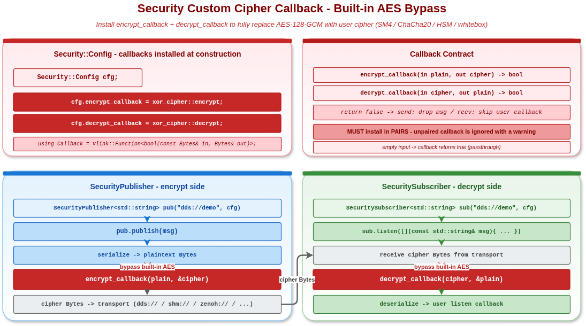

# VLink Security Custom 示例

## 1. 概述

本示例演示通过 `Security::Config::encrypt_callback` / `decrypt_callback` 安装自定义加解密函数，**完全绕过**内置 AES-128-GCM 与 RSA 路径，让上层接入业务自有算法（SM4、ChaCha20、HSM、白盒密码等）。

示例覆盖：

1. 通过命名空间函数(`xor_cipher::encrypt` / `xor_cipher::decrypt`)安装 XOR 对称密码
2. 用 lambda 捕获实现 ROT-N 替换密码
3. encrypt/decrypt 回调的契约与失败语义



## 2. 文件说明

| 文件 | 说明 |
|------|------|
| `security_custom.cc` | 主示例源码 |
| `xor_cipher.h` | 演示用 XOR 密码实现（带 `kDefaultKey` 与 `xor_transform`） |
| `CMakeLists.txt` | 构建配置 |

## 3. 构建与运行

```bash
cmake -B build -S . -DENABLE_EXAMPLES=ON -DENABLE_WHOLE_EXAMPLES=ON -DENABLE_SECURITY=ON
cmake --build build --target example_security_custom
./build/output/bin/example_security_custom
```

## 4. 核心 API

```cpp
// 回调签名（在 include/vlink/extension/security.h 中）：
using Security::Callback = vlink::Function<bool(const Bytes& in, Bytes& out)>;

// 通过 Config 一次性安装（必须成对）：
struct Security::Config {
    Function<bool(const Bytes&, Bytes&)> encrypt_callback;
    Function<bool(const Bytes&, Bytes&)> decrypt_callback;
    // ... 其它字段
};

// 配置随 SecurityXxx 构造函数第二参数一次性传入（无运行时 setter）：
explicit SecurityPublisher(const std::string& url_str,
                           const Security::Config& sec_cfg = {},
                           InitType type = InitType::kWithInit);
```

| 行为 | 说明 |
|------|------|
| 安装后内置 AEAD/RSA 被完全绕过 | 不再调用 OpenSSL，回调即是唯一加解密路径 |
| 双端必须用对称兼容的回调 | 双端 encrypt/decrypt 函数必须使用相同密钥与算法；XOR 自互反指"encrypt 与 decrypt 同一函数"，不代表"双端 key 可不同" |
| 回调返回 `false` | 视为加/解密失败：发送端丢弃消息、接收端不触发用户回调 |
| 与对称/非对称字段共存 | 同时设了 `key` / `public_key_pem` 时，回调路径优先级更高，对称/非对称槽位静默闲置 |

## 5. 回调最小实现

```cpp
auto enc = [key](const vlink::Bytes& in, vlink::Bytes& out) -> bool {
    out = vlink::Bytes::create(in.size());
    for (size_t i = 0; i < in.size(); ++i) {
        out[i] = in.data()[i] ^ key[i % key.size()];
    }
    return true;
};
auto dec = enc;  // XOR 自互反

vlink::Security::Config cfg;
cfg.encrypt_callback = enc;
cfg.decrypt_callback = dec;

vlink::SecurityPublisher<std::string> pub("dds://demo/custom", cfg);
vlink::SecuritySubscriber<std::string> sub("dds://demo/custom", cfg);
```

## 6. 注意事项

- 回调在 `publish` / `listen` 的同一线程被调用，**禁止阻塞**热路径。
- `in` 为空时回调应直接返回 `true`，与默认实现的"空输入直通"约定一致。
- `encrypt_callback` 与 `decrypt_callback` 必须**成对**安装；只设其中之一会被忽略并打印 warning。
- 在 `intra://` 与 `dds://` CDR 类型上，`SecurityXxx` 构造时会打印 warning 并把 `Security::Config` 忽略；在这两种传输上不要启用任何安全配置。
- XOR 仅用于演示，**严禁**生产使用。

## 7. 相关文档

- [doc/09-security.md](../../../doc/09-security.md) §9.7 自定义加密回调
- [`../security_basic/`](../security_basic/) — 内置 AES-128-GCM 用法
- `include/vlink/extension/security.h` — `Security` 类完整接口
