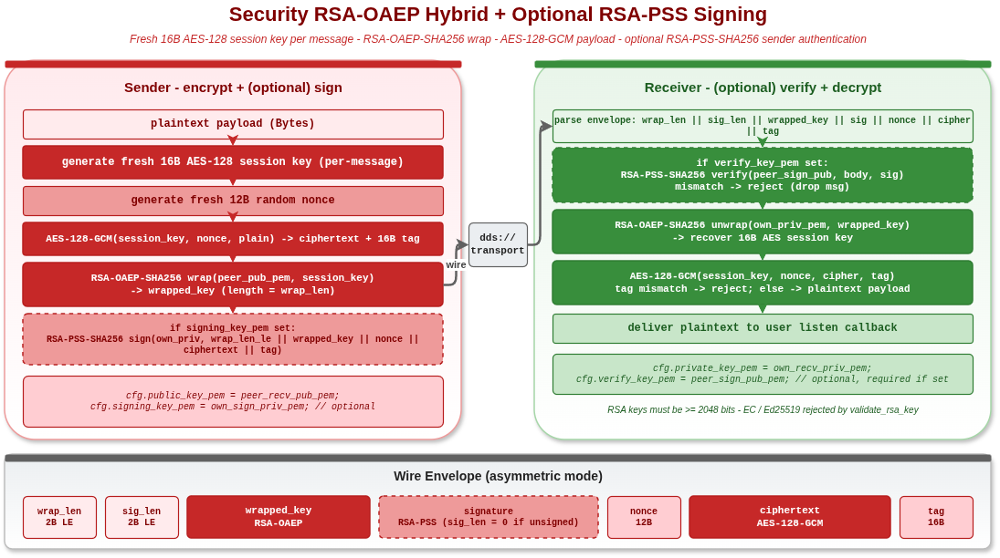

# VLink Security RSA 非对称示例

## 1. 概述

本示例演示 `vlink::Security` 的非对称（hybrid）路径，覆盖：

1. **RSA-OAEP-SHA256 hybrid** —— 用对端 RSA 公钥包装每条消息的 16B AES-128 会话密钥，再用 AES-128-GCM 加密负载；对端用 RSA 私钥解包后 GCM 解密。
2. **RSA-PSS-SHA256 签名认证（可选）** —— 在 hybrid 之上，发送方用自己的 RSA 私钥对 `wrap_len ‖ wrapped_key ‖ nonce ‖ ciphertext ‖ tag` 签名；接收方装上发送方公钥后强制验签。
3. **错签名拒绝** —— 接收方装的 verify key 与发送方实际签名 key 不匹配时，`decrypt()` 返回 false。
4. **独立 `vlink::Security` 实例往返** —— 不依赖 transport。

启动时通过 OpenSSL 临时生成 RSA-2048 keypair，**仅用于演示**。生产部署的 RSA key 应通过 PEM 文件离线分发。



## 2. 编译运行

```bash
cmake -S . -B build -DENABLE_SECURITY=ON -DENABLE_EXAMPLES=ON
cmake --build build --target example_security_rsa
./build/output/bin/example_security_rsa
```

DDS 段需要 Fast-DDS 默认本机 discovery 可用（无需额外 broker）。

## 3. 核心 API

### 3.1 发送方（加密 + 可选签名）

```cpp
vlink::Security::Config sender_cfg;
sender_cfg.public_key_pem  = peer_recv_pub_pem;   // wrap session key
sender_cfg.signing_key_pem = own_sign_priv_pem;   // optional: sign body

vlink::SecurityPublisher<std::string> pub("dds://demo/secure", sender_cfg);
pub.publish("hello");                              // 自动 hybrid + sign
```

### 3.2 接收方（解密 + 可选验签）

```cpp
vlink::Security::Config receiver_cfg;
receiver_cfg.private_key_pem = own_recv_priv_pem; // unwrap session key
receiver_cfg.verify_key_pem  = peer_sign_pub_pem; // require + verify signature

vlink::SecuritySubscriber<std::string> sub("dds://demo/secure", receiver_cfg);
sub.listen([](const std::string& msg) { ... });
```

### 3.3 Wire format（非对称）

```
[2B wrap_len_le][2B sig_len_le][wrap_len B RSA-OAEP wrapped key]
[sig_len B RSA-PSS sig][12B AES nonce][N B ciphertext][16B GCM tag]
```

签名覆盖 `wrap_len_le ‖ wrapped_key ‖ nonce ‖ ciphertext ‖ tag`，不含 `sig_len_le`。`sig_len = 0` 表示未签名（仅当接收方未装 `verify_key_pem` 时才接受）。

## 4. RSA Key 约束

| 约束 | 说明 |
|---|---|
| 算法 | 必须是 RSA；EC / ECDSA / Ed25519 都会被 `validate_rsa_key` 拒绝 |
| 位数 | 至少 2048 bits |
| PEM | 标准 PEM（PKCS#1 或 PKCS#8 私钥；SubjectPublicKeyInfo 公钥） |

## 5. 模式选择

| 场景 | 发送方 cfg | 接收方 cfg |
|---|---|---|
| 仅加密（任意人可发） | `public_key_pem` | `private_key_pem` |
| 加密 + 发送方身份认证 | `public_key_pem` + `signing_key_pem` | `private_key_pem` + `verify_key_pem` |
| 双向 | 两端都设置上述 4 个 PEM | 同左 |

## 6. 限制

- 不支持 `intra://` 和 `dds://` + CDR 类型。
- 不提供 replay 防护（一条合法密文可重放）；如需 replay 防护需在应用层加序列号。
- 单条 RSA-OAEP wrap ≤ 65535 B；超过会被拒绝（实践中远不可能触发）。

## 7. 相关

- 头文件：`include/vlink/extension/security.h`
- 实现：`src/extension/security.cc`
- 文档：`doc/09-security.md`（wire format + 签名范围）
- 同语义对称示例：`examples/security/security_basic`
- 同语义自定义回调示例：`examples/security/security_custom`
- C 端等价示例：`examples/c_api/c_security`
