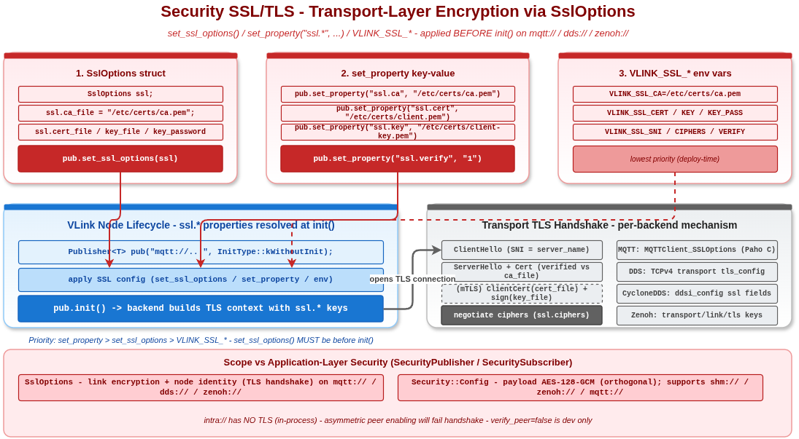

# VLink Security SSL/TLS 示例

## 1. 概述

本示例演示通过 `SslOptions` 配置**传输层** TLS 加密——区别于 `SecurityPublisher` / `SecuritySubscriber` 的应用层 AES：

- 应用层（在 `SecurityXxx` 构造时传入 `Security::Config`）：消息 payload 端到端加密；适用 `shm://` / `shm2://` / `zenoh://` / `mqtt://` / `fdbus://`，**不**支持 `intra://` 与 `dds://`+CDR。
- 传输层(`SslOptions`)：让 transport 自身（如 MQTT、DDS-Security）使用 TLS，进行链路加密 + 节点身份认证。

示例覆盖：

1. `SslOptions` 结构体所有字段含义
2. `set_ssl_options()` API 用法（在 `init()` 前调用）
3. `set_property("ssl.ca", ...)` 字符串键值对等价配置
4. `VLINK_SSL_*` 环境变量（无需改代码即可启用）
5. MQTT over TLS 完整示例（`mqtt://broker:8883`）



## 2. 文件说明

| 文件 | 说明 |
|------|------|
| `security_ssl.cc` | 主示例源码，5 个 Section |
| `CMakeLists.txt` | 构建配置 |

## 3. 构建与运行

```bash
cmake -B build -S . -DENABLE_EXAMPLES=ON -DENABLE_WHOLE_EXAMPLES=ON
cmake --build build --target example_security_ssl
./build/output/bin/example_security_ssl
```

> 示例**不会**真的连接 broker——它只是演示配置 API；要跑通真实 TLS 通信请准备好证书文件并替换路径，且配套启动支持 TLS 的 MQTT broker（如 mosquitto + 自签 CA）。

## 4. 核心 API

```cpp
// include/vlink/impl/ssl_options.h
struct SslOptions {
    std::string ca_file;        // CA 证书（验证对端身份）
    std::string cert_file;      // 本端证书（mTLS 时使用）
    std::string key_file;       // 本端私钥（搭配 cert_file）
    std::string key_password;   // 私钥口令（若加密保存）
    std::string server_name;    // SNI 主机名
    std::string ciphers;        // OpenSSL cipher 字符串
    bool verify_peer{true};     // 是否校验对端证书

    bool is_valid() const noexcept;  // ca_file 或 cert_file 任一非空即视为启用
};

// Node 基类（include/vlink/node.h）：
void set_ssl_options(const SslOptions& options);  // 必须在 init() 之前调用
```

## 5. 配置方式三选一

| 方式 | 用法 | 适用场景 |
|------|------|---------|
| `set_ssl_options(SslOptions{...})` | 代码内显式配置 | 多套配置切换、单元测试 |
| `set_property("ssl.ca", "...")` 等 | 字符串键值（无需 include header） | 与配置中心/文本配置集成 |
| `VLINK_SSL_CA=...` 等环境变量 | 无需改代码 | 部署期注入证书路径 |

字段映射（`set_property` / 环境变量，源码权威：`src/impl/ssl_options.cc:40-108`）：

| SslOptions 字段 | property key | 环境变量 |
|-----------------|--------------|----------|
| `ca_file` | `ssl.ca` | `VLINK_SSL_CA` |
| `cert_file` | `ssl.cert` | `VLINK_SSL_CERT` |
| `key_file` | `ssl.key` | `VLINK_SSL_KEY` |
| `key_password` | `ssl.key_password` | `VLINK_SSL_KEY_PASS` |
| `server_name` | `ssl.server_name` | `VLINK_SSL_SNI` |
| `ciphers` | `ssl.ciphers` | `VLINK_SSL_CIPHERS` |
| `verify_peer` | `ssl.verify` | `VLINK_SSL_VERIFY`（`0` 关闭） |

## 6. 注意事项

- `set_ssl_options()` **必须**在 `init()` 之前调用；构造 `Publisher`/`Subscriber` 时使用 `InitType::kWithoutInit` 推迟初始化。
- `intra://` 不走网络，**不支持** TLS；适用 transport：`mqtt://`、`dds://`、`zenoh://`。
- 单端开启 TLS 而对端未开启 → 握手失败、连接拒绝。
- `verify_peer=false` 关闭对端校验**仅用于开发**；生产必须开启并搭配 CA。

## 7. 相关文档

- [doc/09-security.md](../../../doc/09-security.md) §9.7 传输层 TLS
- [doc/21-environment-vars.md](../../../doc/21-environment-vars.md) — `VLINK_SSL_*` 环境变量表
- `include/vlink/impl/ssl_options.h` — `SslOptions` 完整定义
