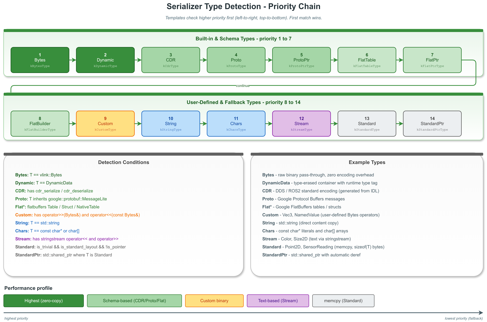

# String 类型序列化示例

## 1. 类型检测优先级链



## 2. 概述

本示例演示如何使用 VLink 发布和订阅 `std::string` 类型的消息。`std::string` 被识别为 `kStringType`（编号 10），序列化时将字符串内容直接转换为 `Bytes` 缓冲区，反序列化时从 `Bytes` 还原为 `std::string`。

## 3. 关键代码解析

### 3.1 编译期类型检测

```cpp
static_assert(Serializer::get_type_of<std::string>() == Serializer::kStringType,
              "std::string must be detected as kStringType");
```

`kStringType` 在检测链中排名第 10 位。VLink 专门为 `std::string` 提供了独立的序列化类型，而不是将其归类为流类型（`kStreamType`）或自定义类型（`kCustomType`），这是因为字符串是最常用的消息类型之一，需要专门的高效处理路径。

### 3.2 各种字符串场景

```cpp
// 普通 ASCII 字符串
pub.publish(std::string("Hello, VLink!"));

// UTF-8 多字节字符
pub.publish(std::string("VLink supports UTF-8 encoding"));

// 空字符串（合法的零长度消息）
pub.publish(std::string(""));

// 超长字符串（超过 Bytes 的 96 字节 SBO 阈值）
std::string long_str(200, 'A');
pub.publish(long_str);

// 包含特殊字符的字符串（换行、制表、嵌入的 null 字节）
pub.publish(std::string("line1\nline2\ttab\0embedded_null", 29));
```

几个重要的边界情况：
- **空字符串**：是合法的消息，会触发订阅者回调，`msg.size()` 为 0
- **超长字符串**：超过 96 字节后 `Bytes` 会从堆分配内存，对用户完全透明
- **嵌入的 null 字节**：`std::string` 可以包含 `\0`，注意构造时必须指定长度

### 3.3 序列化/反序列化往返验证

```cpp
std::string original = "round-trip test payload";
Bytes buf;
Serializer::serialize(original, buf);    // string -> Bytes

std::string restored;
Serializer::deserialize(buf, restored);  // Bytes -> string
// original == restored
```

`kStringType` 的序列化就是将 `std::string` 的内容（`data()` + `size()`）拷贝到 `Bytes` 缓冲区。反序列化时从 `Bytes` 构造 `std::string`。整个过程简单高效。

## 4. 构建与运行

```bash
cmake -B build -S . -DCMAKE_PREFIX_PATH=/path/to/vlink/install
cmake --build build --target example_string_type
./build/output/bin/example_string_type
```

## 5. 要点总结

| 要点 | 说明 |
|------|------|
| 序列化类型 | `kStringType`（编号 10） |
| 检测条件 | `T == std::string` |
| 序列化方式 | 字符串内容直接拷贝到 Bytes |
| UTF-8 支持 | 完全支持——按字节透传，不做编码转换 |
| 空字符串 | 合法消息，订阅者会收到回调 |
| 性能 | 高效——仅一次内存拷贝 |
