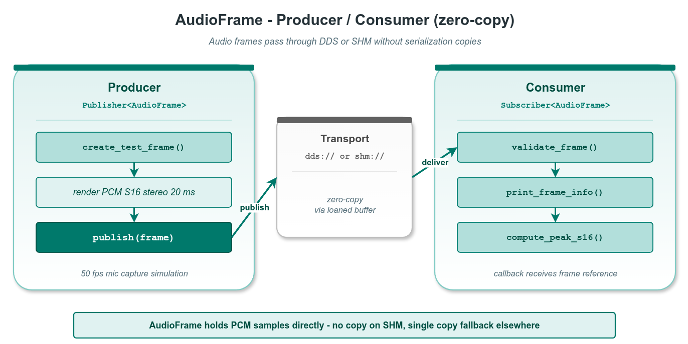

# zerocopy_audio_frame — 音频帧两进程零拷贝传递

本示例演示 `vlink::zerocopy::AudioFrame` 在真实 SHM 拓扑下的端到端使用：producer 进程把 PCM 数据写入 SHM、consumer 进程映射进自己地址空间、全程零拷贝。这是 vlink 零拷贝在语音 / 车载 IVI 流水线中的典型场景。

读完本示例你能掌握：

- `AudioFrame` 的字段布局（sample_rate / num_channels / num_samples / bit_depth / format / layout / codec / language / duration_ns）。
- 通过 `Publisher<AudioFrame>` / `Subscriber<AudioFrame>` 在 `shm://` 上传递音频帧。
- producer / consumer 拆为两个可执行文件、共享 helper 头的多进程示例结构。
- 接收端 `is_owner() == false` 的含义（数据借自 wire）。

## 背景与适用场景

`AudioFrame` 是 vlink 内置的零拷贝音频帧容器，目标场景：

- 麦克风采集（16 / 24 / 32 bit PCM，单 / 双声道）。
- 车载语音命令、TTS 输出、远场对讲。
- 实时语音通话（Opus / AAC 编码帧）。
- 多麦阵列融合 / 波束形成中间产物。

不适合：

- 整段录音文件（用文件 IO 或 BagWriter `.vbag` 直接读写）。
- 跨主机高质量音频（用 WebRTC / RTP，自带 jitter buffer + FEC）。

`shm://` 传输靠 Iceoryx RouDi 守护进程维护 SHM 池；producer 调 `Publisher::loan()` 取出一段 SHM 内存，consumer 在收到事件后直接映射到自己进程的虚拟地址 —— 整个过程没有 user-space 复制。

## 核心 API

| API | 签名/字段 | 说明 |
|-----|---------|------|
| `vlink::zerocopy::AudioFrame` | 默认构造 | empty frame |
| `AudioFrame::create(size_t)` | `bool` | 分配音频缓冲（字节数） |
| `AudioFrame::set_format` | `void (Format)` | PCM_S16 / PCM_S24 / PCM_S32 / PCM_F32 / PCM_U8 / Opus / AAC / MP3 / FLAC |
| `AudioFrame::set_layout` | `void (Layout)` | kLayoutInterleaved / kLayoutPlanar |
| `AudioFrame::set_sample_rate` | `void (uint32_t)` | 采样率 Hz（44100 / 48000 / 16000 ...） |
| `AudioFrame::set_num_channels` | `void (uint16_t)` | 1 = 单声道，2 = 立体声 |
| `AudioFrame::set_num_samples` | `void (uint32_t)` | 每通道采样数 |
| `AudioFrame::set_bit_depth` | `void (uint16_t)` | PCM 位深（16 / 24 / 32） |
| `AudioFrame::set_bitrate` | `void (uint32_t)` | 压缩码率 bps（PCM 留 0） |
| `AudioFrame::set_duration_ns` | `void (uint64_t)` | 帧时长 ns |
| `AudioFrame::set_codec` / `set_language` | `void (string_view)` | 编解码器名 / 语言标签 |
| `AudioFrame::data` / `size` | `uint8_t* / size_t` | 音频缓冲访问 |
| `AudioFrame::header` | 公开字段 | seq / time_pub / time_meas / frame_id |
| `AudioFrame::is_owner` | `bool` | 是否拥有底层内存 |
| `AudioFrame::operator>>` / `operator<<` | const / mut | 与 Bytes 互转 |

## 代码导读

### 1. Producer

```cpp
// producer.cc
vlink::Publisher<vlink::zerocopy::AudioFrame> pub("shm://example/zerocopy/audio_frame");
pub.wait_for_subscribers();

for (uint32_t seq = 1; seq <= 10; ++seq) {
  vlink::zerocopy::AudioFrame frame;
  frame.set_sample_rate(48000);
  frame.set_num_channels(2);
  frame.set_num_samples(960);          // 20 ms @ 48 kHz
  frame.set_bit_depth(16);
  frame.set_format(vlink::zerocopy::AudioFrame::kFormatPcmS16);
  frame.set_layout(vlink::zerocopy::AudioFrame::kLayoutInterleaved);
  frame.set_codec("PCM");
  frame.create(960 * 2 * sizeof(int16_t));
  frame.header.seq = seq;

  // 填充 440Hz / 660Hz 双正弦波（详见 audio_producer.h）
  pub.publish(frame);
}
```

### 2. Consumer

```cpp
// consumer.cc
vlink::Subscriber<vlink::zerocopy::AudioFrame> sub("shm://example/zerocopy/audio_frame");
sub.listen([](const vlink::zerocopy::AudioFrame& frame) {
  // 直接按 format 解析 borrow 来的指针
  const int16_t* samples = reinterpret_cast<const int16_t*>(frame.data());
  VLOG_I("audio seq=", frame.header.seq, " sr=", frame.sample_rate(),
         " ch=", frame.num_channels(), " samples=", frame.num_samples(),
         " size=", frame.size(), " owner=", frame.is_owner());
});

vlink::MessageLoop loop;
loop.run();
```

Consumer 端 `frame.is_owner() == false`：数据在 SHM 中，不归 consumer 进程所有 —— 析构时不会释放 SHM。

### 3. helper 头

`audio_producer.h` / `audio_consumer.h` 抽出公共逻辑：可执行文件构造 Publisher/Subscriber、注册回调、跑 loop。两个 .cc 文件薄薄一层 main。

## 运行

```bash
# 启动 RouDi（如未跑）
iox-roudi &

# 终端 1
./build/output/bin/example_audio_frame_consumer

# 终端 2
./build/output/bin/example_audio_frame_producer
```

预期 consumer 端输出（节选）：

```
[Audio] seq=1 codec=PCM lang=en sr=48000 ch=2 bits=16 samples=960 duration_ns=20000000 size=3840 is_owner=0
  peak_s16=16000
...
[Audio] seq=10 codec=PCM lang=en sr=48000 ch=2 bits=16 samples=960 duration_ns=20000000 size=3840 is_owner=0
  peak_s16=16000
```

## 常见陷阱

1. **没启 RouDi**：`shm://` 无法 discovery；producer wait_for_subscribers 超时。
2. **create 大小算错**：`num_samples * num_channels * (bit_depth/8)`；位深 24 时是 3 字节 / 样本，最容易出错。
3. **interleaved vs planar 假设错位**：consumer 端默认按 layout 字段解析；自定义 reinterpret_cast 前确认 `frame.layout()`。
4. **PCM_F32 与 PCM_S16 混用**：format 字段错配会让 reinterpret_cast 出现倍幅度差；保持 producer / consumer 同时配置。
5. **consumer 持有 frame 太久**：SHM 池可能耗尽；快速消费完，或在订阅端用 `set_manual_unloan(true)` + 显式 `return_loan`。

## 设计要点

- `AudioFrame` 内置 header（seq、时间戳、frame_id）+ 音频元数据（sample_rate / num_channels / bit_depth / codec / language）；按 vlink schema 通过传输层传递。
- `is_owner` 区分本地构造（owner=true）vs wire 接收（owner=false）。
- Format 枚举既覆盖未压缩 PCM（S16 / S24 / S32 / F32 / U8），也覆盖常见有损 / 无损编码（Opus / AAC / MP3 / FLAC）。
- `duration_ns` 用纳秒明确标注帧长，避免下游做 `num_samples / sample_rate` 的浮点运算。

## 配图



图中展示两进程通过 SHM 共享同一个 audio frame 的内存视图：producer 写入 SHM，consumer 直接映射访问。

## 参考

- `../zerocopy_basic/` — loan API 与 RawData 基础
- `../zerocopy_camera_frame/` — 摄像头帧零拷贝
- `vlink/include/vlink/zerocopy/audio_frame.h` — AudioFrame 接口
- 顶层 `doc/10-zerocopy.md` — 零拷贝机制
