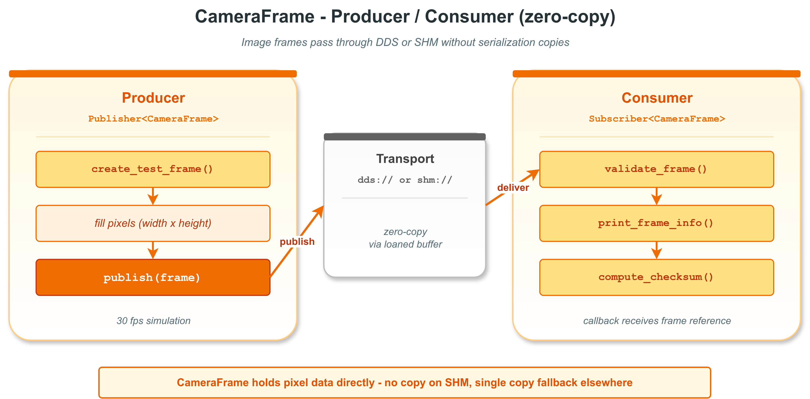

# zerocopy_camera_frame — 摄像头帧两进程零拷贝传递

本示例演示 `vlink::zerocopy::CameraFrame` 在真实 SHM 拓扑下的端到端使用：producer 进程把像素写入 SHM、consumer 进程映射进自己地址空间、全程零拷贝。这是 vlink 零拷贝最具代表性的场景之一。

读完本示例你能掌握：

- `CameraFrame` 的字段布局（width / height / format / stream / freq / channel）。
- 通过 `Publisher<CameraFrame>` / `Subscriber<CameraFrame>` 在 `shm://` 上传递帧。
- producer / consumer 拆为两个可执行文件、共享 helper 头的多进程示例结构。
- 接收端 `is_owner() == false` 的含义（数据借自 wire）。

## 背景与适用场景

`CameraFrame` 是 vlink 内置的零拷贝图像容器，目标场景：

- ADAS / 机器人前后视相机帧（NV12 / YUV420）。
- 高带宽视频流（4K @ 30fps）。
- 大对象禁拷贝的多进程拓扑（producer 在 driver 进程、consumer 在多个感知进程）。

不适合：

- 单进程内部传图（直接用 std::shared_ptr<cv::Mat> 或 IntraData）。
- 跨主机传图（用 RTP / WebRTC / 自家协议）。

`shm://` 传输靠 Iceoryx RouDi 守护进程维护 SHM 池；producer 调 `Publisher::loan()` 取出一段 SHM 内存，consumer 在收到事件后直接映射到自己进程的虚拟地址 —— 整个过程没有 user-space 复制。

## 核心 API

| API | 签名/字段 | 说明 |
|-----|---------|------|
| `vlink::zerocopy::CameraFrame` | 默认构造 | empty frame |
| `CameraFrame::create(size_t)` | `void` | 分配像素缓冲（含 header） |
| `CameraFrame::set_width / set_height` | `void (uint32_t)` | 帧尺寸 |
| `CameraFrame::set_format` | `void (Format)` | NV12 / YUV420 / Jpeg / H264 / H265 等 |
| `CameraFrame::set_stream_type` | `void (StreamType)` | I / P / B 帧标记（视频流） |
| `CameraFrame::set_freq` / `set_channel` | `void` | 采样频率、通道号 |
| `CameraFrame::data` / `size` | `uint8_t* / size_t` | 像素缓冲访问 |
| `CameraFrame::header` | 公开字段 | seq / time_pub / time_meas / frame_id |
| `CameraFrame::is_owner` | `bool` | 是否拥有底层内存 |
| `CameraFrame::operator>>` / `operator<<` | const / mut | 与 Bytes 互转 |

## 代码导读

### 1. Producer

```cpp
// producer.cc
vlink::Publisher<vlink::zerocopy::CameraFrame> pub("shm://camera/front");
pub.wait_for_subscribers();

for (int i = 0; i < 10; ++i) {
  vlink::zerocopy::CameraFrame frame;
  frame.create(320 * 240 * 3 / 2);     // NV12 = 1.5 byte/pixel
  frame.set_width(320);
  frame.set_height(240);
  frame.set_format(vlink::zerocopy::CameraFrame::kFormatNv12);
  frame.set_freq(30);
  frame.header.seq = i;

  // 填测试图案
  std::memset(frame.data(), static_cast<uint8_t>(i * 10), frame.size());

  pub.publish(frame);
  std::this_thread::sleep_for(33ms);
}
```

### 2. Consumer

```cpp
// consumer.cc
vlink::Subscriber<vlink::zerocopy::CameraFrame> sub("shm://camera/front");
sub.listen([](const vlink::zerocopy::CameraFrame& frame) {
  uint32_t cs = 0;
  for (size_t i = 0; i < frame.size(); ++i) {
    cs += frame.data()[i];
  }
  VLOG_I("frame seq=", frame.header.seq, " ", frame.get_width(), "x", frame.get_height(),
         " format=", static_cast<int>(frame.get_format()), " checksum=", cs,
         " owner=", frame.is_owner());
});

// 主线程跑 loop
MessageLoop loop;
loop.run();
```

Consumer 端 `frame.is_owner() == false`：数据在 SHM 中，不归 consumer 进程所有 —— 析构时不会释放 SHM。

### 3. helper 头

`frame_producer.h` / `frame_consumer.h` 抽出公共逻辑：可执行文件构造 Publisher/Subscriber、注册回调、跑 loop。两个 .cc 文件薄薄一层 main。

## 运行

```bash
# 启动 RouDi（如未跑）
iox-roudi &

# 终端 1
./build/output/bin/example_camera_consumer

# 终端 2
./build/output/bin/example_camera_producer
```

预期 consumer 端输出（节选）：

```
frame seq=0 320x240 format=2 checksum=... owner=0
frame seq=1 320x240 format=2 checksum=... owner=0
...
frame seq=9 320x240 format=2 checksum=... owner=0
```

## 常见陷阱

1. **没启 RouDi**：`shm://` 无法 discovery；producer wait_for_subscribers 超时。
2. **producer 先退出**：consumer 可能拿到部分帧后失去发布者；这是正常行为（不是错误）。
3. **CameraFrame::create 大小算错**：NV12 = w*h*1.5，YUV420 = w*h*1.5，JPEG 可变 size。
4. **set_width/height 之后不 create**：data() 返回空。
5. **consumer 持有 frame 太久**：SHM 池可能耗尽；用 `set_manual_unloan(true)` + 显式 return_loan，或快速消费完。

## 设计要点

- `CameraFrame` 内置 header（seq、时间戳、frame_id）+ 视频元数据；按 vlink schema 通过传输层传递。
- `is_owner` 区分本地构造（owner=true）vs wire 接收（owner=false）。
- Format 枚举与 ROS / ffmpeg 格式对齐：NV12 / YUV420 / JPEG / H264 / H265 等。

## 配图



图中展示两进程通过 SHM 共享同一张 frame 的内存视图：producer 写入 SHM，consumer 直接映射访问。

## 参考

- `../zerocopy_basic/` — loan API 与 RawData 基础
- `../zerocopy_point_cloud/` — 点云零拷贝
- `vlink/include/vlink/zerocopy/camera_frame.h` — CameraFrame 接口
- 顶层 `doc/10-zerocopy.md` — 零拷贝机制
