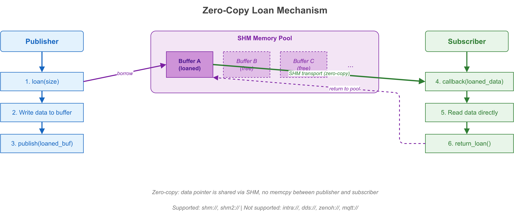

# 零拷贝 Loan API 示例

## 1. 概述

本示例演示 VLink 的零拷贝 Loan API，包括 `loan()`、`return_loan()`、`is_support_loan()` 和 `set_manual_unloan()`。Loan API 允许发布者从传输层的内存池中借用缓冲区，直接填充数据后发布，避免额外的内存分配和拷贝。



## 2. 核心概念

### 2.1 什么是 Loan？

在传统的发布模式中，用户需要先分配一块内存（`Bytes::create(size)`），填充数据，然后调用 `publish()`。传输层可能还需要将数据拷贝到自己的发送缓冲区。

Loan 机制允许用户直接从传输层的内存池中"借用"一块缓冲区：

```
传统模式:  用户分配 -> 填充 -> publish -> 传输层拷贝 -> 发送
Loan 模式: loan -> 填充 -> publish -> 发送（零拷贝）
```

### 2.2 支持 Loan 的传输

| 传输协议 | 支持 Loan | 说明 |
|---------|----------|------|
| `shm://` | 是 | Iceoryx 共享内存池 |
| `shm2://` | 是 | 第二代共享内存 |
| `intra://` | 否 | 进程内传输不需要 Loan |
| `dds://` | 否 | DDS 有自己的缓冲管理 |
| `zenoh://` | 否 | Zenoh 内部管理 |

## 3. 关键 API 解析

### 3.1 is_support_loan()

```cpp
Publisher<Bytes> pub("shm://topic");
if (pub.is_support_loan()) {
  // 传输层提供内存池，可以使用 loan
}
```

在使用 loan 之前**必须先检查**。`intra://` 返回 `false`，`shm://` 返回 `true`。

### 3.2 loan(size)

```cpp
Bytes buf = pub.loan(sizeof(SensorData));
if (!buf.empty()) {
  auto* sensor = reinterpret_cast<SensorData*>(buf.data());
  sensor->id = 1;
  pub.publish(buf);  // loan 自动归还
}
```

`loan()` 从传输层的内存池中分配指定大小的缓冲区。返回空 `Bytes` 表示分配失败（内存池已满或不支持 loan）。

### 3.3 return_loan(bytes)

```cpp
Bytes unused = pub.loan(1024);
// 决定不使用这个缓冲区
pub.return_loan(unused);  // 手动归还到内存池
```

如果借用了缓冲区但最终没有发布，需要调用 `return_loan()` 归还。通过 `publish()` 发送的 loan 会自动归还，不需要手动调用。

### 3.4 set_manual_unloan(true)

```cpp
Subscriber<Bytes> sub("shm://topic");
sub.set_manual_unloan(true);

sub.listen([&sub](const Bytes& msg) {
  // 处理数据...
  sub.return_loan(msg);  // 手动归还接收缓冲区
});
```

默认情况下，订阅者接收到的 loan 缓冲区在回调返回后自动归还。启用手动模式后，用户需要在处理完数据后显式调用 `return_loan()`。这在需要异步处理数据时非常有用。

## 4. 推荐使用模式

```cpp
Publisher<Bytes> pub("shm://topic/data");

if (pub.is_support_loan()) {
    Bytes buf = pub.loan(payload_size);
    if (!buf.empty()) {
        // 直接在 loan 缓冲区中填充数据
        fill_data(buf.data(), payload_size);
        pub.publish(buf);  // 零拷贝发送
    }
} else {
    // 回退到常规模式
    Bytes buf = Bytes::create(payload_size);
    fill_data(buf.data(), payload_size);
    pub.publish(buf);
}
```

## 5. 编译与运行

```bash
cd build
cmake .. && make example_zerocopy_loan
./output/bin/example_zerocopy_loan
```

## 6. 预期输出

由于 `dds://` 不支持 loan，示例中的 loan 操作会返回空缓冲区或 `false`。要体验真正的零拷贝 loan，需要将传输协议改为 `shm://` 并配置共享内存基础设施。

## 7. API 总结

| 方法 | 描述 |
|------|------|
| `is_support_loan()` | 检查传输是否提供内存池 |
| `loan(size)` | 从传输内存池借用缓冲区 |
| `return_loan(bytes)` | 归还未使用的借用缓冲区 |
| `set_manual_unloan(true)` | 订阅者手动控制缓冲区生命周期 |
| `is_manual_unloan()` | 检查是否启用手动归还模式 |

## 8. 注意事项

- 在 `intra://` 上使用 loan API 不会报错，但 `loan()` 返回空 `Bytes`
- loan 缓冲区不能在回调之外持有太久，否则可能耗尽内存池
- `set_manual_unloan(true)` 后忘记调用 `return_loan()` 会导致内存泄漏
- SHM 传输的 loan 性能优势在大数据量（>4KB）时最为明显

## 9. 相关文档

详细原理参见 [doc/10-zerocopy.md](../../../doc/10-zerocopy.md)。
