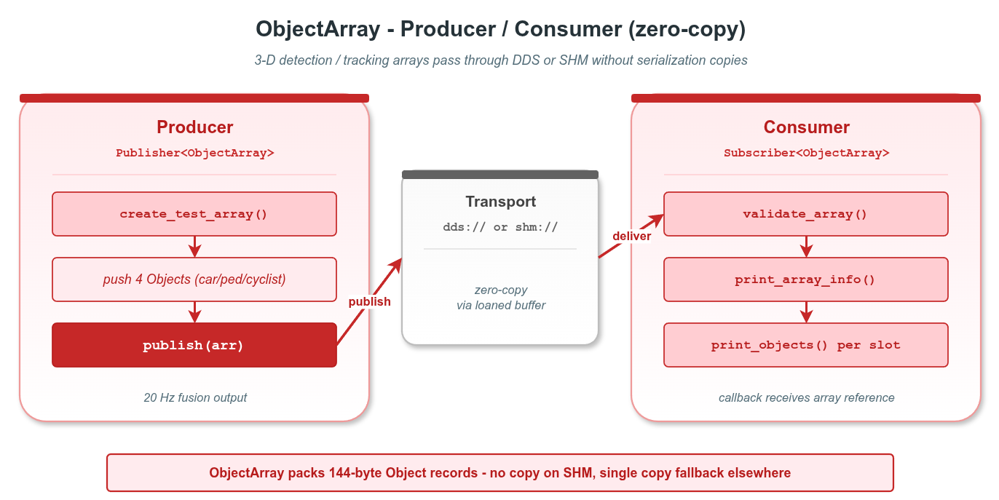

# zerocopy_object_array — 3D 检测对象数组两进程零拷贝传递

本示例演示 `vlink::zerocopy::ObjectArray` 在真实 SHM 拓扑下的端到端使用：producer 进程把检测对象写入 SHM、consumer 进程映射进自己地址空间、全程零拷贝。这是 vlink 零拷贝在感知 / 融合 / 跟踪输出环节的典型场景。

读完本示例你能掌握：

- `ObjectArray` 的字段布局（source_id / channel / freq / count / pack_size）。
- `Object` POD 144 字节记录的字段（位姿 / 尺寸 / 运动学 / 分类 / 跟踪 / 协方差）。
- 通过 `Publisher<ObjectArray>` / `Subscriber<ObjectArray>` 在 `shm://` 上传递变长数组。
- producer / consumer 拆为两个可执行文件、共享 helper 头的多进程示例结构。
- 接收端 `is_owner() == false` 的含义（数据借自 wire）。

## 背景与适用场景

`ObjectArray` 是 vlink 内置的零拷贝目标检测 / 跟踪结果容器，目标场景：

- 3D 目标检测输出（车 / 人 / 自行车 / 障碍物 bounding box）。
- 多传感器融合后的统一 obstacle 列表（Camera / LiDAR / Radar 融合）。
- 多目标跟踪（MOT）输出，含 track_id / age / 速度 / 加速度 / 协方差。
- 下游 prediction / planning 模块的输入。

不适合：

- 极大量稀疏点（>10000 检测，用 PointCloud 形态更合适）。
- 字段维度高度动态的检测结果（用 DynamicData）。

`shm://` 传输靠 Iceoryx RouDi 守护进程维护 SHM 池；producer 调 `Publisher::loan()` 取出一段 SHM 内存，consumer 在收到事件后直接映射到自己进程的虚拟地址 —— 整个过程没有 user-space 复制。

## 核心 API

| API | 签名/字段 | 说明 |
|-----|---------|------|
| `vlink::zerocopy::ObjectArray` | 默认构造 | empty array |
| `ObjectArray::create(size_t)` | `bool` | 预分配 N 个 Object 槽 |
| `ObjectArray::push_value` | `bool (const Object&)` | 追加一个 Object |
| `ObjectArray::set_value` | `bool (uint32_t, const Object&)` | 覆盖指定 index |
| `ObjectArray::get_value` | `Object (uint32_t)` const | 读 Object（值返回） |
| `ObjectArray::resize` | `bool (uint32_t)` | 调整 logical count（不能超 capacity） |
| `ObjectArray::set_source_id` | `void (string_view)` | 源模块 ID（≤15 字节） |
| `ObjectArray::objects(idx)` | `const Object*` | 按 index 取借用指针（零拷贝） |
| `ObjectArray::count / capacity / pack_size` | `uint32_t` | 当前数 / 容量 / 单条字节数 |
| `ObjectArray::header` | 公开字段 | seq / time_pub / time_meas / frame_id |
| `ObjectArray::is_owner` | `bool` | 是否拥有底层内存 |
| `ObjectArray::operator>>` / `operator<<` | const / mut | 与 Bytes 互转 |
| `Object` POD | `label / position / size / yaw / velocity / class_id / track_id / motion_state / source_type` | 直接字段访问，无 setter |

## 代码导读

### 1. Producer

```cpp
// producer.cc
vlink::Publisher<vlink::zerocopy::ObjectArray> pub("shm://example/zerocopy/object_array");
pub.wait_for_subscribers();

for (uint32_t seq = 1; seq <= 10; ++seq) {
  vlink::zerocopy::ObjectArray arr;
  arr.set_source_id("fusion_v1");
  arr.create(16);                  // 预分配 16 个 Object 槽
  arr.header.seq = seq;

  vlink::zerocopy::ObjectArray::Object obj{};
  std::strncpy(obj.label, "car", sizeof(obj.label) - 1);
  obj.position[0] = 12.0F;
  obj.velocity[0] = 8.5F;
  obj.size[0] = 4.5F;
  obj.size[1] = 1.8F;
  obj.size[2] = 1.6F;
  obj.class_id = 1;
  obj.track_id = 101;
  obj.motion_state = vlink::zerocopy::ObjectArray::kMotionMoving;
  obj.source_type = vlink::zerocopy::ObjectArray::kSourceFusion;
  arr.push_value(obj);

  pub.publish(arr);
}
```

### 2. Consumer

```cpp
// consumer.cc
vlink::Subscriber<vlink::zerocopy::ObjectArray> sub("shm://example/zerocopy/object_array");
sub.listen([](const vlink::zerocopy::ObjectArray& arr) {
  VLOG_I("array seq=", arr.header.seq, " source=", arr.source_id(),
         " count=", arr.count(), " owner=", arr.is_owner());

  for (uint32_t i = 0; i < arr.count(); ++i) {
    const auto* obj = arr.objects(i);
    VLOG_I("  obj[", i, "] label=", obj->label, " pos=(", obj->position[0], ",",
           obj->position[1], ") yaw=", obj->yaw);
  }
});

vlink::MessageLoop loop;
loop.run();
```

Consumer 端 `arr.is_owner() == false`：数据在 SHM 中，不归 consumer 进程所有 —— 析构时不会释放 SHM。

### 3. helper 头

`array_producer.h` / `array_consumer.h` 抽出公共逻辑：可执行文件构造 Publisher/Subscriber、注册回调、跑 loop。两个 .cc 文件薄薄一层 main。

## 运行

```bash
# 启动 RouDi（如未跑）
iox-roudi &

# 终端 1
./build/output/bin/example_object_array_consumer

# 终端 2
./build/output/bin/example_object_array_producer
```

预期 consumer 端输出（节选）：

```
[Array] seq=1 source=fusion_v1 count=4 pack_size=144 capacity=2304 is_owner=0
  [obj#0] label=car class=1 track=101 pos=(12.5,0.3,0) vel=(8.5,0) yaw=0.05 ...
  [obj#1] label=pedestrian class=2 track=102 pos=(3.5,-1.9,0) vel=(0,1.2) yaw=1.5708 ...
  [obj#2] label=cyclist class=3 track=103 pos=(7.4,1.5,0) vel=(4,0) yaw=0.1 ...
  [obj#3] label=car class=1 track=104 pos=(15,-3.5,0) vel=(0,0) yaw=0 ...
```

## 常见陷阱

1. **没启 RouDi**：`shm://` 无法 discovery；producer wait_for_subscribers 超时。
2. **`Object` 只有公共字段，没有 setter**：直接赋值；label 用 `strncpy` 并保证 NUL 结尾。
3. **push_value 超过 capacity**：返回 false；调用前用 `count() < capacity() / pack_size()` 检查。
4. **`Object` alignas(4) 不是 8**：wire 上 payload 从 offset 116 起，仅 4 字节对齐；自定义 reinterpret_cast 时记得跨平台对齐策略。
5. **consumer 持有 arr 太久**：SHM 池可能耗尽；快速消费完，或在订阅端用 `set_manual_unloan(true)` + 显式 `return_loan`。

## 设计要点

- `ObjectArray` 内置 header（seq、时间戳、frame_id）+ 源模块 / 通道元数据；按 vlink schema 通过传输层传递。
- `is_owner` 区分本地构造（owner=true）vs wire 接收（owner=false）。
- `Object` 144 字节定长 POD，所有字段直接公开访问，避免 getter / setter 的额外语法噪声。
- `count / capacity` 解耦逻辑长度与物理容量；`resize` 不重新分配，适合每帧填充不同数量的检测。

## 配图



图中展示两进程通过 SHM 共享同一个 array 的内存视图：producer 写入 SHM，consumer 直接映射访问。

## 参考

- `../zerocopy_basic/` — loan API 与 RawData 基础
- `../zerocopy_camera_frame/` — 摄像头帧零拷贝
- `vlink/include/vlink/zerocopy/object_array.h` — ObjectArray 接口
- 顶层 `doc/10-zerocopy.md` — 零拷贝机制
