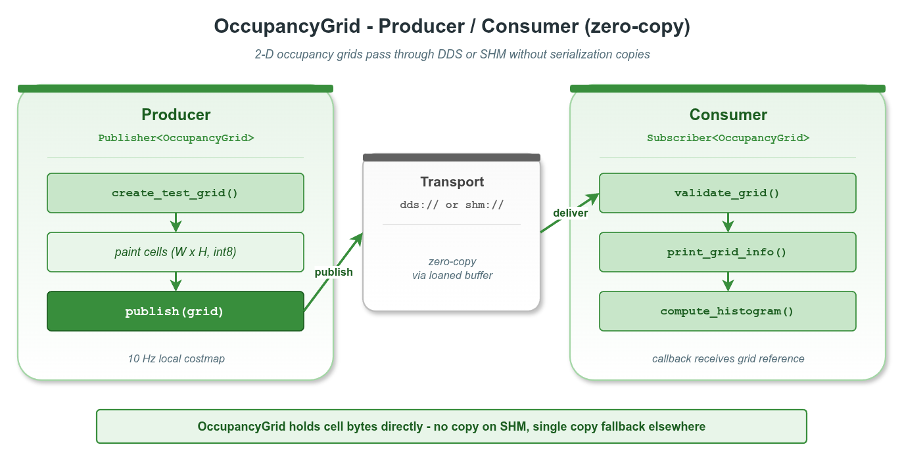

# zerocopy_occupancy_grid — 占据栅格两进程零拷贝传递

本示例演示 `vlink::zerocopy::OccupancyGrid` 在真实 SHM 拓扑下的端到端使用：producer 进程把栅格数据写入 SHM、consumer 进程映射进自己地址空间、全程零拷贝。这是 vlink 零拷贝在导航 / 建图栈中的典型场景。

读完本示例你能掌握：

- `OccupancyGrid` 的字段布局（width / height / resolution / origin / cell_type / 阈值 / 默认值 / 有效格子数）。
- 通过 `Publisher<OccupancyGrid>` / `Subscriber<OccupancyGrid>` 在 `shm://` 上传递栅格。
- producer / consumer 拆为两个可执行文件、共享 helper 头的多进程示例结构。
- 接收端 `is_owner() == false` 的含义（数据借自 wire）。

## 背景与适用场景

`OccupancyGrid` 是 vlink 内置的零拷贝 2D 栅格容器，目标场景：

- ROS 风格 `nav_msgs/OccupancyGrid` 局部 / 全局栅格地图。
- 高分辨率 costmap（uint16 / float32 cell）。
- log-odds 概率栅格、签名距离场（SDF）。
- 多层栅格栈（不同 origin_z 表示多楼层）。

不适合：

- 极稀疏地图（点云 / KD-Tree 表达更合适）。
- 大于 ~64 MB 的全局静态地图（一次性 load，不需要实时通信）。

`shm://` 传输靠 Iceoryx RouDi 守护进程维护 SHM 池；producer 调 `Publisher::loan()` 取出一段 SHM 内存，consumer 在收到事件后直接映射到自己进程的虚拟地址 —— 整个过程没有 user-space 复制。

## 核心 API

| API | 签名/字段 | 说明 |
|-----|---------|------|
| `vlink::zerocopy::OccupancyGrid` | 默认构造 | empty grid |
| `OccupancyGrid::create(size_t)` | `bool` | 分配 cell 缓冲（字节数） |
| `OccupancyGrid::set_width / set_height` | `void (uint32_t)` | 栅格行列数 |
| `OccupancyGrid::set_resolution` | `void (float)` | 米/格 |
| `OccupancyGrid::set_origin_x/y/z/yaw` | `void (float)` | 世界坐标系下的原点位姿 |
| `OccupancyGrid::set_cell_type` | `void (CellType)` | int8 / uint8 / uint16 / float32 |
| `OccupancyGrid::set_default_value` | `void (int32_t)` | 未知格子的默认值 |
| `OccupancyGrid::set_occupied_threshold / set_free_threshold` | `void (float)` | 占据 / 空闲阈值 |
| `OccupancyGrid::set_valid_cell_count` | `void (uint32_t)` | 非默认格子数（稀疏度提示） |
| `OccupancyGrid::set_map_id` | `void (string_view)` | 地图标识（≤15 字节） |
| `OccupancyGrid::data` / `size` | `uint8_t* / size_t` | cell 缓冲访问 |
| `OccupancyGrid::header` | 公开字段 | seq / time_pub / time_meas / frame_id |
| `OccupancyGrid::is_owner` | `bool` | 是否拥有底层内存 |
| `OccupancyGrid::operator>>` / `operator<<` | const / mut | 与 Bytes 互转 |

## 代码导读

### 1. Producer

```cpp
// producer.cc
vlink::Publisher<vlink::zerocopy::OccupancyGrid> pub("shm://example/zerocopy/occupancy_grid");
pub.wait_for_subscribers();

for (uint32_t seq = 1; seq <= 10; ++seq) {
  vlink::zerocopy::OccupancyGrid grid;
  grid.set_width(200);
  grid.set_height(200);
  grid.set_resolution(0.05F);     // 5cm/格
  grid.set_origin_x(-5.0F);
  grid.set_origin_y(-5.0F);
  grid.set_cell_type(vlink::zerocopy::OccupancyGrid::kCellInt8);
  grid.set_default_value(-1);     // ROS 风格 unknown
  grid.create(200 * 200);          // int8 -> 每格 1 字节
  grid.header.seq = seq;

  // 填充圆形障碍图案（详见 grid_producer.h）
  pub.publish(grid);
}
```

### 2. Consumer

```cpp
// consumer.cc
vlink::Subscriber<vlink::zerocopy::OccupancyGrid> sub("shm://example/zerocopy/occupancy_grid");
sub.listen([](const vlink::zerocopy::OccupancyGrid& grid) {
  uint32_t free_cells = 0;
  uint32_t occupied_cells = 0;
  uint32_t unknown_cells = 0;
  // 自定义直方图：统计 free / occupied / unknown 数量
  VLOG_I("grid seq=", grid.header.seq, " ", grid.width(), "x", grid.height(),
         " resolution=", grid.resolution(), " owner=", grid.is_owner());
});

vlink::MessageLoop loop;
loop.run();
```

Consumer 端 `grid.is_owner() == false`：数据在 SHM 中，不归 consumer 进程所有 —— 析构时不会释放 SHM。

### 3. helper 头

`grid_producer.h` / `grid_consumer.h` 抽出公共逻辑：可执行文件构造 Publisher/Subscriber、注册回调、跑 loop。两个 .cc 文件薄薄一层 main。

## 运行

```bash
# 启动 RouDi（如未跑）
iox-roudi &

# 终端 1
./build/output/bin/example_occupancy_grid_consumer

# 终端 2
./build/output/bin/example_occupancy_grid_producer
```

预期 consumer 端输出（节选）：

```
[Grid] seq=1 id=demo_local_map 200x200 resolution=0.05m cell_type=1 size=40000 is_owner=0
  histogram free=... occupied=... unknown=...
...
[Grid] seq=10 id=demo_local_map 200x200 resolution=0.05m cell_type=1 size=40000 is_owner=0
```

## 常见陷阱

1. **没启 RouDi**：`shm://` 无法 discovery；producer wait_for_subscribers 超时。
2. **producer 先退出**：consumer 可能拿到部分栅格后失去发布者；这是正常行为（不是错误）。
3. **create 大小算错**：`width * height * cell_size_of(cell_type)`，int8=1、uint16=2、float32=4。
4. **cell_type 未设就 create**：cell_size 为 0，后续解析会失败。
5. **consumer 持有 grid 太久**：SHM 池可能耗尽；快速消费完，或在订阅端用 `set_manual_unloan(true)` + 显式 `return_loan`。

## 设计要点

- `OccupancyGrid` 内置 header（seq、时间戳、frame_id）+ 地图元数据；按 vlink schema 通过传输层传递。
- `is_owner` 区分本地构造（owner=true）vs wire 接收（owner=false）。
- CellType 对齐 ROS `nav_msgs/OccupancyGrid`（int8 = -1 / 0..100）、costmap_2d（uint8 = 0..254）、概率地图（float32）。
- `valid_cell_count` 是 sparsity hint；下游可以用它做稀疏地图压缩 / 跳过空帧。

## 配图



图中展示两进程通过 SHM 共享同一个 grid 的内存视图：producer 写入 SHM，consumer 直接映射访问。

## 参考

- `../zerocopy_basic/` — loan API 与 RawData 基础
- `../zerocopy_camera_frame/` — 摄像头帧零拷贝
- `vlink/include/vlink/zerocopy/occupancy_grid.h` — OccupancyGrid 接口
- 顶层 `doc/10-zerocopy.md` — 零拷贝机制
