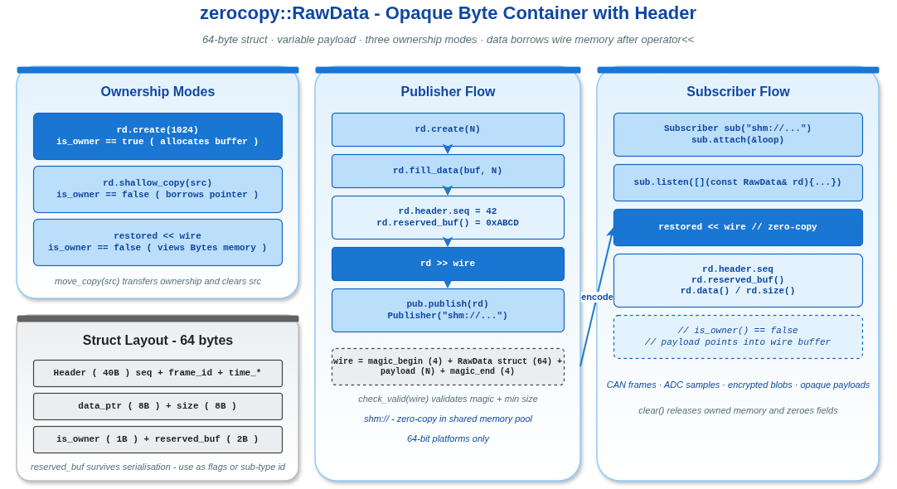

# RawData 零拷贝原始数据容器示例

## 1. 概述

本示例演示 VLink 的 `zerocopy::RawData` 容器——最简单的零拷贝数据类型。`RawData` 封装一个无类型的字节缓冲区，配合 `Header` 提供序列号和时间戳。适用于负载格式不透明或由应用层自定义的场景。



## 2. 核心概念

### 2.1 RawData 结构

`RawData` 在 64 位平台上恰好 64 字节，加上可变长度的负载数据：

```
[Header(40B)] [data_ptr(8B)] [size(8B)] [is_owner(1B)] [reserved(2B)] [padding(5B)]
```

### 2.2 三种所有权模式

| 模式 | 创建方式 | is_owner | 描述 |
|------|---------|----------|------|
| 拥有 | `create(size)` | true | 析构时自动释放 |
| 借用 | `shallow_copy(ptr, size)` | false | 调用者管理生命周期 |
| 反序列化 | `operator<<(bytes)` | false | 数据指向 Bytes 内存 |

## 3. 关键 API 解析

### 3.1 创建缓冲区

```cpp
zerocopy::RawData rd;
rd.create(1024);  // 分配 1024 字节的拥有缓冲区
```

### 3.2 fill_data 填充数据

```cpp
rd.fill_data(raw_ptr, size);  // deep_copy 的别名
```

### 3.3 Header 和 reserved_buf

```cpp
rd.header.seq = 42;
rd.header.time_meas = measurement_ns;
rd.header.time_pub = publish_ns;
rd.reserved_buf() = 0xABCD;  // 16 位用户自定义字段
```

`reserved_buf()` 是一个 16 位字段，通过序列化传输，可以用于标志位或子类型标识。

### 3.4 序列化 / 反序列化

```cpp
Bytes wire;
rd >> wire;           // 序列化

zerocopy::RawData restored;
restored << wire;     // 反序列化（零拷贝）
// restored.is_owner() == false
```

### 3.5 浅拷贝 / 深拷贝 / 移动

```cpp
zerocopy::RawData shallow;
shallow.shallow_copy(source);  // 借用数据指针

zerocopy::RawData deep;
deep.deep_copy(source);        // 分配新缓冲区并复制

zerocopy::RawData moved;
moved.move_copy(source);       // 转移所有权，source 变为空
```

## 4. 编译与运行

```bash
cd build
cmake .. && make example_zerocopy_raw_data
./output/bin/example_zerocopy_raw_data
```

## 5. 二进制线格式

```
[ magic_begin(4) | RawData结构体(64) | 负载数据(N) | magic_end(4) ]
```

`check_valid(bytes)` 验证首尾魔数和最小尺寸。

## 6. 实际应用场景

- 传输自定义二进制协议数据
- CAN 总线原始帧转发
- 传感器原始采集数据（ADC 采样等）
- 加密/压缩后的不透明负载
- 任何不需要结构化元数据的二进制传输

## 7. 与 Bytes 的区别

| 特性 | RawData | Bytes |
|------|---------|-------|
| Header（序列号/时间戳） | 有 | 无 |
| reserved_buf 字段 | 有 | 无 |
| 零拷贝反序列化 | 是（借用 wire 内存） | 否 |
| 魔数校验 | 是 | 否 |
| 结构体大小 | 固定 64 字节 | 可变 |

## 8. 注意事项

- `operator<<` 后数据指针引用源 `Bytes` 的内存
- `create()` 不初始化缓冲区内容
- `clear()` 释放资源并将所有字段清零
- 32 位架构不受支持
- `fill_data(nullptr, 0)` 返回 `false`
