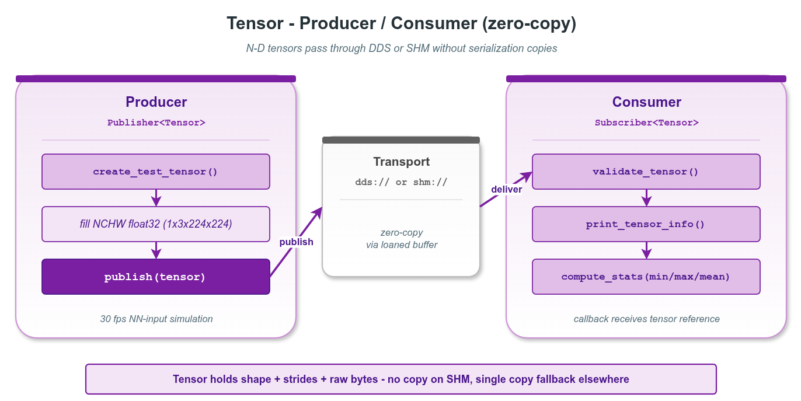

# zerocopy_tensor — N 维张量两进程零拷贝传递

本示例演示 `vlink::zerocopy::Tensor` 在真实 SHM 拓扑下的端到端使用：producer 进程把张量数据写入 SHM、consumer 进程映射进自己地址空间、全程零拷贝。这是 vlink 零拷贝在感知 / 推理流水线中最重要的场景之一。

读完本示例你能掌握：

- `Tensor` 的字段布局（shape / strides / dtype / layout / num_elements / 量化参数 / device 提示）。
- 通过 `Publisher<Tensor>` / `Subscriber<Tensor>` 在 `shm://` 上传递张量。
- producer / consumer 拆为两个可执行文件、共享 helper 头的多进程示例结构。
- 接收端 `is_owner() == false` 的含义（数据借自 wire）。

## 背景与适用场景

`Tensor` 是 vlink 内置的零拷贝 N 维张量容器，目标场景：

- ADAS / 机器人感知前端把 RGB 图像送入分类 / 检测 / 分割模型（NCHW float32）。
- BEV / occupancy network 输出的多通道特征图（NCHW float16 / bf16）。
- 大语言模型 / VLM / 扩散模型隐藏状态、token embedding、注意力图。
- INT8 量化推理（dtype = kInt8 + quant_scale / quant_zero_point）。
- 多模型流水线之间的特征张量传递。

不适合：

- 单 scalar 或极小数组（直接走 std::array + Bytes 即可）。
- 跨主机张量（用 RPC + 内置压缩 / 切片更稳）。

`shm://` 传输靠 Iceoryx RouDi 守护进程维护 SHM 池；producer 调 `Publisher::loan()` 取出一段 SHM 内存，consumer 在收到事件后直接映射到自己进程的虚拟地址 —— 整个过程没有 user-space 复制。

## 核心 API

| API | 签名/字段 | 说明 |
|-----|---------|------|
| `vlink::zerocopy::Tensor` | 默认构造 | empty tensor |
| `Tensor::create(size_t)` | `bool` | 分配数据缓冲（字节数） |
| `Tensor::set_dtype` | `void (DataType)` | 元素类型（自动缓存 element_size） |
| `Tensor::set_shape` | `void (const uint32_t*, uint8_t)` | shape + strides + num_elements 一并写入 |
| `Tensor::set_layout` | `void (string_view)` | "NCHW" / "NHWC" / "BLC" 等布局标签 |
| `Tensor::set_name` / `set_model_id` | `void (string_view)` | 张量名 / 模型 ID |
| `Tensor::set_device` | `void (Device)` | kDeviceCpu / kDeviceGpu / kDeviceNpu / kDeviceDsp |
| `Tensor::set_quant_scale / set_quant_zero_point` | `void` | INT8 量化参数 |
| `Tensor::num_elements / shape / strides` | const | 形状信息 |
| `Tensor::data` / `size` | `uint8_t* / size_t` | 数据缓冲访问 |
| `Tensor::header` | 公开字段 | seq / time_pub / time_meas / frame_id |
| `Tensor::is_owner` | `bool` | 是否拥有底层内存 |
| `Tensor::operator>>` / `operator<<` | const / mut | 与 Bytes 互转 |

## 代码导读

### 1. Producer

```cpp
// producer.cc
vlink::Publisher<vlink::zerocopy::Tensor> pub("shm://example/zerocopy/tensor");
pub.wait_for_subscribers();

for (uint32_t seq = 1; seq <= 10; ++seq) {
  vlink::zerocopy::Tensor tensor;
  tensor.set_name("image");
  tensor.set_layout("NCHW");
  tensor.set_dtype(vlink::zerocopy::Tensor::kFloat32);
  const uint32_t shape[4] = {1, 3, 224, 224};
  tensor.set_shape(shape, 4);
  tensor.create(tensor.num_elements() * sizeof(float));
  tensor.header.seq = seq;

  // 填充 sin/cos 模式（详见 tensor_producer.h）
  pub.publish(tensor);
}
```

### 2. Consumer

```cpp
// consumer.cc
vlink::Subscriber<vlink::zerocopy::Tensor> sub("shm://example/zerocopy/tensor");
sub.listen([](const vlink::zerocopy::Tensor& tensor) {
  // 直接按 dtype 解析 borrow 来的指针
  const float* values = reinterpret_cast<const float*>(tensor.data());
  VLOG_I("tensor seq=", tensor.header.seq, " name=", tensor.name(),
         " layout=", tensor.layout(), " num_elements=", tensor.num_elements(),
         " size=", tensor.size(), " owner=", tensor.is_owner());
});

vlink::MessageLoop loop;
loop.run();
```

Consumer 端 `tensor.is_owner() == false`：数据在 SHM 中，不归 consumer 进程所有 —— 析构时不会释放 SHM。

### 3. helper 头

`tensor_producer.h` / `tensor_consumer.h` 抽出公共逻辑：可执行文件构造 Publisher/Subscriber、注册回调、跑 loop。两个 .cc 文件薄薄一层 main。

## 运行

```bash
# 启动 RouDi（如未跑）
iox-roudi &

# 终端 1
./build/output/bin/example_tensor_consumer

# 终端 2
./build/output/bin/example_tensor_producer
```

预期 consumer 端输出（节选）：

```
[Tensor] seq=1 name=image layout=NCHW rank=4 num_elements=150528 dtype=12 size=602112 is_owner=0
  stats min=... max=... mean=...
...
[Tensor] seq=10 name=image layout=NCHW rank=4 num_elements=150528 dtype=12 size=602112 is_owner=0
```

## 常见陷阱

1. **没启 RouDi**：`shm://` 无法 discovery；producer wait_for_subscribers 超时。
2. **set_shape 之前忘记 set_dtype**：element_size 未缓存；num_elements * element_size 会失真。
3. **shape rank > kMaxRank (8)**：set_shape 内部会 clamp；保险起见调用前手动断言。
4. **create 大小 = num_elements * element_size**：常见错误是漏乘 sizeof。
5. **consumer 持有 tensor 太久**：SHM 池可能耗尽；快速消费完，或在订阅端用 `set_manual_unloan(true)` + 显式 `return_loan`。

## 设计要点

- `Tensor` 内置 header（seq、时间戳、frame_id）+ 推理元数据（name / model_id / layout / device）；按 vlink schema 通过传输层传递。
- `is_owner` 区分本地构造（owner=true）vs wire 接收（owner=false）。
- shape 与 strides 都被持有；非连续视图（NCHW slice 进大张量）能完整 round-trip。
- DataType 对齐 ONNX / PyTorch / TensorFlow（bool / int8..64 / uint8..64 / fp16 / bf16 / fp32 / fp64）。

## 配图



图中展示两进程通过 SHM 共享同一个 tensor 的内存视图：producer 写入 SHM，consumer 直接映射访问。

## 参考

- `../zerocopy_basic/` — loan API 与 RawData 基础
- `../zerocopy_camera_frame/` — 摄像头帧零拷贝
- `vlink/include/vlink/zerocopy/tensor.h` — Tensor 接口
- 顶层 `doc/10-zerocopy.md` — 零拷贝机制
